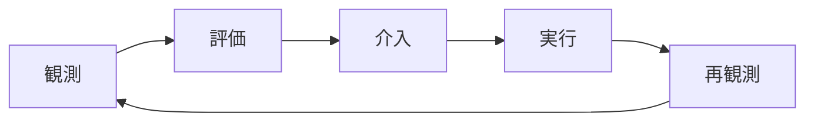
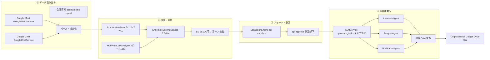
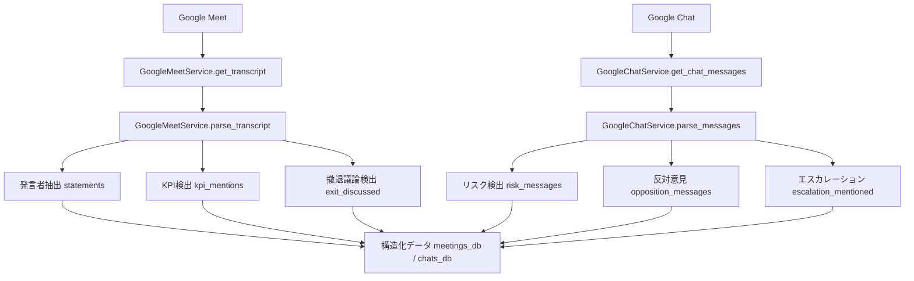
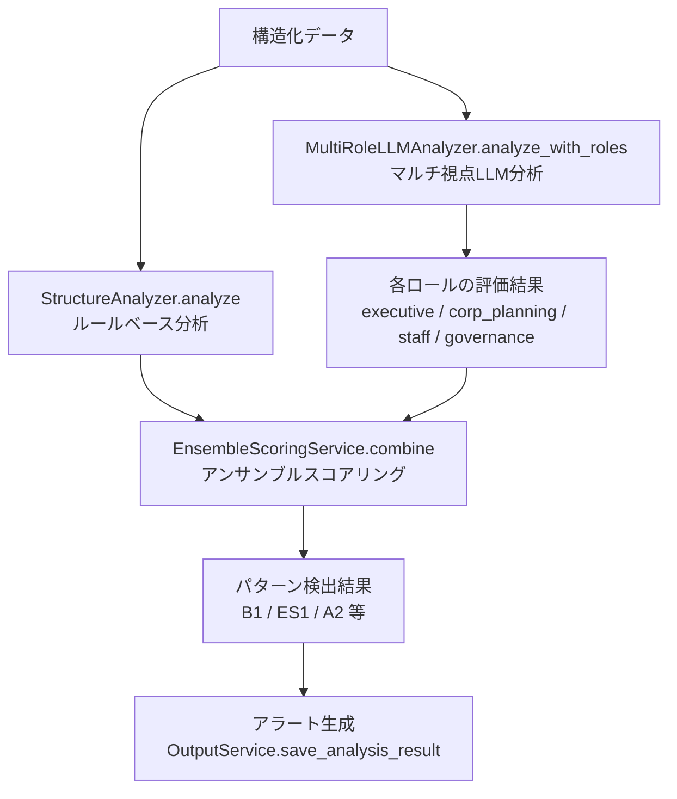
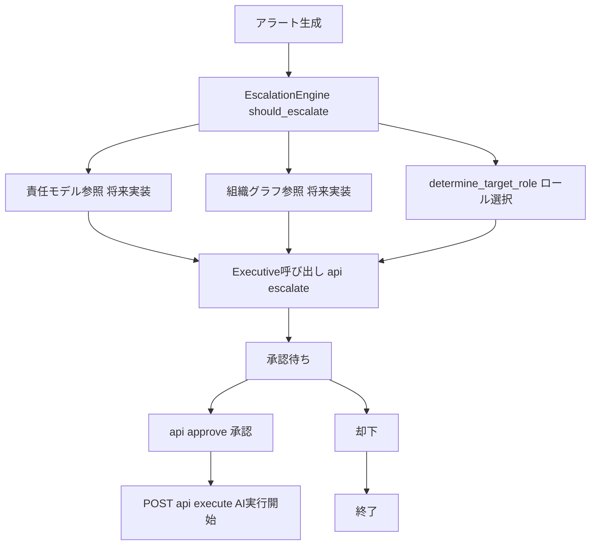
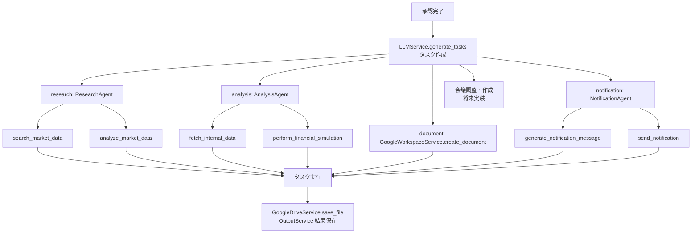
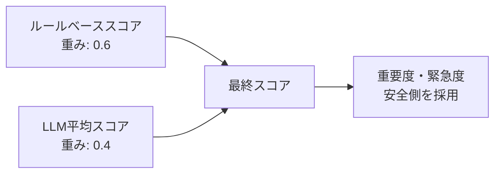

[ここにデモ動画を配置]

## はじめに

> **「AIを賢くするのではない。
> "人とAIでできた組織"を賢くする。」**

Helmは、**組織構造そのものをリードするAIエージェント**です。既存のAIエージェントがタスクや成果物を最適化するのに対し、Helmは**組織の意思決定プロセスが「構造的に壊れている」問題**を検知し、改善します。

## ある新規事業の会議上での物語：「感情と政治」による判断の遅延

### BEFORE：人手による監視・判断

四半期経営会議でKPI悪化が共有されたが、戦略変更の議論が起きなかった場合を例に説明します。

**具体的なシーン：**

経営会議では、CFOが「モバイルARPUは前年同期比▲6.2%、5G設備投資は当初計画比＋18%」と報告しているのに、CEOは「厳しいが、我々の戦略自体は間違っていないと思う」と正当化し、会議の結論は「2025年度計画は維持。次回進捗報告は3か月後」となっています。

一方、会議後のチャットでは、「数字かなり厳しかったですね」「撤退案を口に出せる空気ではなかったですね」と本音が漏れているのに、それが会議には反映されません。

このような状況では、以下の問題が発生します：

- **見落とし**：膨大な会議・チャットログから予兆検知不可。構造的問題（正当化フェーズ、報告遅延、撤退判断の遅れ）が検知されない
- **遅延**：構造的問題に気づくのが遅い（1〜2週間、場合によっては数ヶ月）
- **バイアス**：忖度・「始めたからには」心理により、代替案の検討が行われない

### AFTER：Helmによる自律支援

Helmが構造的問題を検知し、経営層を自動的に呼び出します。

**具体的なシーン：**

Helmが会議議事録とチャットログを分析し、マルチ視点評価システムにより構造的問題（KPI悪化が続いているにも関わらず、戦略変更の議論が行われない状態）を検知します。スコア評価結果よりエスカレーションが必要と判断されます。

Helmは自動的に経営層を呼び出し、「正当化フェーズの兆候が検出されました。構造的変更には経営層の承認が必要です。」というエスカレーション理由を生成します。経営層は、介入案（次回経営会議に撤退選択肢を含めた3案比較を強制議題化）を確認し承認すると、AIが自律的にタスクを実行します。

3週間後の経営会議では、撤退案スライドが議題の1つとして自然に含まれ、CFOが「投資凍結オプション」の財務影響について具体的に言及するようになります。

## 問題提起：既存組織の意思決定は「構造的に壊れている」

AIがこれほど社会・会社・組織に浸透し始めているなかで、なぜ意思決定の時間や経営判断の遅延は手が入らないのだろうか。

----
パーソル総合研究所「無駄な社内会議による企業損失額調査」（2018年9月）によると、部長級管理職の週平均会議時間は**8.6時間**で、経営層のレビュー負荷は**週15時間**にも及びます[^5]。

組織での意思決定プロセスには、単にAIツールを入れても解決出来ない**構造・組織的な問題**が存在します。これは、個々のタスクや成果物の問題ではなく、「責任曖昧」「バイアス」「人主導の限界」の3つの壁を超えられるAIの設計が今のツール群には存在していないからです。

[^5]: https://rc.persol-group.co.jp/news/201809060935/

### 既存ツールでは解決できない根本的な問題

既存のAIツールやプロジェクト管理ツール（Asana、Jira、CrewAI、AutoGenなど）は、**タスクや成果物を最適化**することに焦点を当てています。しかし、これらのツールでは解決できない根本的な問題があります：

- **「誰が判断するか」が不明確**：重要な判断（撤退判断、仮説棄却等）の責任者が曖昧
- **「いつ判断すべきか」が分からない**：構造的問題の兆候を検知する仕組みがない
- **「判断の質」が向上しない**：組織構造そのものの改善が行われない

これらは、タスク管理や成果物の最適化では解決できず、**組織構造そのものの観測・評価・再設計**が必要な問題です。

## どう解決するか：Helmの機能コンセプト

Helmは、**組織そのものを評価・判断するシステム**を構築します。従来の「人がAIを呼び出す」から「AIが人を呼び出す」へ転換することで、組織の構造的問題を自動検知し、適切なタイミングで適切な人に判断を求める仕組みを実現します。

### Helmを構成する3つの中核機能

#### ① 多角的な評価・判断システム

Helmは、**ルールベース（0.6） × LLM（0.4）** のハイブリッド評価により、見落としのない統合判断を実現します。

ルールベース分析では、KPI下方修正回数、撤退議論の有無、判断集中率（最も多く発言した人の発言数 / 総発言数）などの定量的指標に基づいて、安全側のベースライン評価を行います。一方、マルチ視点LLM分析では、同じ会議ログとチャットログを、4つの異なる視点から評価します：

- **経営者視点（重み: 0.4）**：全社の業績・リスク・ステークホルダー責任の観点から評価
- **経営企画視点（重み: 0.3）**：KPI・事業ポートフォリオ・撤退/投資判断の観点から評価
- **現場視点（重み: 0.2）**：実行可能性と現場負荷の観点から評価
- **ガバナンス視点（重み: 0.1）**：報告遅延・隠れたリスク・コンプライアンスの観点から評価

これらの評価結果をアンサンブルスコアリング（統合評価）で統合することで、単一の評価軸では見落としがちな問題も、複数の視点から検知できるようになります。

#### ② AIが人を呼び出し、判断を依頼

構造的問題を検知すると、Helmは自動で**役員 / 部長 / スタッフ**を特定し、判断・承認を依頼します。

人がAIを監視するのではなく、**AIが組織を監視し、人に判断を求める**という逆転の発想を実現しています。責任モデル（組織内の各役割がどのような判断に責任を持つかを定義したモデル）に基づいて、適切なロールを決定し、「なぜこの人を呼び出すべきか」を説明可能な形で生成します。

#### ③ 学習・改善PDCAの自動化

Helmは、以下のループを自動で回します：

組織構造の「壊れ方」を学習し、時間とともに**組織自体が賢くなる**仕組みを実現します。例えば、Helmが検知した構造的問題に対して経営層が介入し、その結果を次のサイクルで再観測することで、組織の意思決定プロセスが継続的に改善されていきます。

### 参考：Helmが解決する課題の調査事例

従業員1,000名以上の企業では、以下の実データが報告されています：

**意思決定リードタイムの遅延**

株式会社IDEATECH「大企業・エンプラの意思決定プロセス実態調査」（2025年6月）によると、新規サービス導入の意思決定期間は、平均で**約4-5ヶ月（120-150日）**にのぼります[^1]。戦略的意思決定と新規事業の意思決定を平均すると、**平均意思決定リードタイムは70〜85日**となります。

[^1]: https://prtimes.jp/main/html/rd/p/000000421.000045863.html
    
**新規事業の高い失敗率**
- 株式会社スーパーソフトウエア「新規事業に関する実態調査」（2023年6月）：**6割以上（60%以上）が失敗**[^2]
- PwC Japan「新規事業開発の取り組みに関する実態調査2025年」（2025年11月）：投資回収まで至った企業は**約2割（20%）**のみ[^3]
- NTTデータ「なぜ81％の新規事業がグロースに失敗するのか？」（2024年9月）：**81%の事業が成長段階で失敗**[^4]

**Helm導入による定量的効果：**

- 意思決定リードタイム：**2日以内（97%削減、35倍改善）**
- Zombie Project検知率：**90%以上**
- 代替案検討率：**50%以上（5倍以上改善）**
- 経営層レビュー負荷：**3h/週（80%削減）**

----
ここからは技術編になります！

## 実行プロセス：具体的なデータフロー

### ステップ1：データ取り込み

Google Meet / Chat / 会議資料から議事録・ログを取得し、構造化します。

Google Meet APIから議事録を取得し、発言者抽出、KPI検出、撤退議論検出、リスク検出などのパース処理を実行し、JSONの構造化データに変換します。

### ステップ2：検知・評価

ルールベース＋マルチLLMで問題特定を行います。

ルールベース分析では、KPI下方修正回数、撤退議論の有無、判断集中率などの定量的指標に基づいて構造的問題を検知します。マルチ視点LLM分析では、4つのロール視点（経営者、経営企画、現場、ガバナンス）から同一データを評価し、アンサンブルスコアリングで統合します。
このスコアの結果をもとに、評価を事前に用意されているパターンに割り当て、アラートを作成。(※パターン設計については検討中につき変更可能性あり)

### ステップ3：アラート発行

責任モデル（組織内の各役割がどのような判断に責任を持つかを定義したモデル）に基づきAIが人を呼び出します。

構造的問題が検知されると、Helmは自動的に適切なロール（経営層等）を決定し、エスカレーション理由を生成します。

### ステップ4：AI自律実行

タスク分解、資料作成、会議設定まで実行します。

経営層の承認後、HelmはADK（Agent Development Kit）を使用したマルチエージェントシステムで自律的にタスクを実行します。具体的には、市場データ分析、社内データ統合、3案比較資料の自動生成、関係部署への事前通知、会議アジェンダの更新などを行います。

## アーキテクチャ設計

### システム全体図

ビジネス上の流れを一覧で示した図です。左から右へ「データ取り込み → 検知・評価 → アラート → 承認 → AI実行 → 保存」の順で進みます。

| 段階 | 主なAPI・サービス |
|------|-------------------|
| ① | `POST /api/meetings/ingest`, `POST /api/chat/ingest`, `POST /api/materials/ingest` |
| ② | `POST /api/analyze`（StructureAnalyzer + MultiRoleLLMAnalyzer + EnsembleScoringService） |
| ③ | `POST /api/escalate`, `POST /api/approve`（EscalationEngine） |
| ④ | `POST /api/execute`（LLMタスク生成 → ADKエージェント実行）、`GET /api/execution/{id}/ws`（WebSocket進捗） |

---

## 各フロー詳細

#### 1. データ取り込みフロー

**API**: `POST /api/meetings/ingest`, `POST /api/chat/ingest`, `POST /api/materials/ingest`

| ツール・サービス | 役割 |
|------------------|------|
| **GoogleMeetService** | 議事録取得（`get_transcript`）、パース（`parse_transcript`） |
| **GoogleChatService** | チャット取得（`get_chat_messages`）、パース（`parse_messages`） |

議事録パースでは発言者抽出・KPI検出・撤退議論検出、チャットパースではリスク検出・エスカレーション検出・反対意見検出を行い、構造化データとして保持します。

#### 2. 構造的問題検知フロー（マルチ視点評価システム）

**API**: `POST /api/analyze`

| ツール・サービス | 役割 |
|------------------|------|
| **StructureAnalyzer** | ルールベース分析（KPI下方修正回数、撤退議論の有無、判断集中率、反対意見無視） |
| **MultiRoleLLMAnalyzer** | 4ロール（executive / corp_planning / staff / governance）で同一データをLLM評価 |
| **EnsembleScoringService** | 0.6×ルール + 0.4×LLM で統合、重要度・緊急度は安全側を採用 |
| **ScoringService** | 各 finding の重要度・緊急度評価 |
| **OutputService** | 分析結果の保存（`save_analysis_result`） |

**検出パターン例**: B1_正当化フェーズ、ES1_報告遅延、A2_撤退判断の遅れ（LLM検出）

#### 3. Executive呼び出しフロー

**API**: `POST /api/escalate`, `POST /api/approve`

| ツール・サービス | 役割 |
|------------------|------|
| **EscalationEngine** | `should_escalate`（閾値・重要度で判断）、`determine_target_role`（ロール選択）、`generate_escalation_reason`（理由生成） |
| 責任モデル・組織グラフ | 将来実装（現在は常に Executive を選択） |

#### 4. AI自律実行フロー（ADKエージェント）

**API**: `POST /api/execute`, `GET /api/execution/{id}/ws`（WebSocket進捗）

| ツール・サービス | 役割 |
|------------------|------|
| **LLMService.generate_tasks** | 承認内容からタスクリストを生成（research / analysis / notification / document 等） |
| **TaskWorkflowAgent** | タスク依存解決と実行順制御、SharedContext でエージェント間共有 |
| **ResearchAgent** | `search_market_data`, `analyze_market_data`（将来: Vertex AI Search） |
| **AnalysisAgent** | `fetch_internal_data`, `perform_financial_simulation`（将来: Google Drive API） |
| **NotificationAgent** | `generate_notification_message`, `send_notification`（Phase1: ドラフトのみ、将来: Chat/Gmail API） |
| **GoogleWorkspaceService** | `research_market_data`, `analyze_data`, `create_document`（資料作成） |
| **GoogleDriveService** | `save_file`, ダウンロードURL取得 |
| **OutputService** | `save_task_generation_result`、結果JSON保存 |

■各アーキテクチャ詳細  
https://github.com/killertcell428/Helm/blob/main/ARCHITECTURE.md

## 技術スタック

| カテゴリ                           | 技術                          | 選定理由                                                                                            | 具体的活用方法                                                                                                                    |
| ---------------------------------- | ----------------------------- | --------------------------------------------------------------------------------------------------- | --------------------------------------------------------------------------------------------------------------------------------- |
| **フロントエンド**           | Next.js 16                    | Reactベースのフレームワークで、SSRとSSGをサポート。デモページの高速表示を実現                       | Case1/Case2/Case3のデモページを構築。API Client（lib/api.ts）でバックエンドと通信                                                 |
|                                    | TypeScript                    | 型安全性の確保により、開発時のエラーを早期発見                                                      | APIレスポンスの型定義、コンポーネントの型安全性を確保                                                                             |
|                                    | Tailwind CSS                  | ユーティリティファーストのCSSフレームワークで、迅速なUI開発を実現                                   | デモページのスタイリング、レスポンシブデザインの実装                                                                              |
| **バックエンド**             | FastAPI                       | PythonベースのAPIフレームワークで、非同期処理とWebSocketをサポート                                  | REST APIエンドポイント（/api/meetings/ingest, /api/analyze等）とWebSocketエンドポイント（/api/execution/{execution_id}/ws）を実装 |
|                                    | Python 3.11+                  | 主要なプログラミング言語。型ヒントとパフォーマンス改善を活用                                        | サービス層の実装、LLM統合、データ処理                                                                                             |
|                                    | Uvicorn                       | ASGIサーバーで、FastAPIの非同期処理をサポート                                                       | 本番環境でのAPIサーバーとして使用                                                                                                 |
| **AI/ML**                    | Gemini 2.0 Flash (Gen AI SDK) | Google Cloudの生成AIモデル。マルチ視点評価と構造的問題検知に最適                                    | マルチ視点LLM分析（4つのロール視点から評価）、構造的問題検知、タスク生成、説明文生成                                              |
| **データベース（将来実装）** | Firestore                     | NoSQLデータベース。組織グラフ（組織内の上下関係や報告関係を表す図）管理と構造的問題記録に適している | 組織グラフ管理、構造的問題記録、エスカレーション履歴の保存                                                                        |
|                                    | BigQuery                      | データウェアハウス。時系列データ分析とメトリクス集計に最適                                          | 時系列データ分析、メトリクス集計、長期トレンド分析                                                                                |
| **Google Cloud統合**         | Google Meet API               | 議事録取得に使用                                                                                    | 会議議事録の取得、発言者抽出、KPI検出                                                                                             |
|                                    | Google Chat API               | チャットメッセージ取得に使用                                                                        | チャットログの取得、本音の兆候検出                                                                                                |
|                                    | Google Workspace API          | 資料生成と通知送信に使用                                                                            | 資料ドラフト作成、関係者への通知送信                                                                                              |
|                                    | Google Drive API              | ファイル保存と共有に使用                                                                            | 生成された資料の保存、ダウンロードURL生成                                                                                         |
| **リアルタイム通信**         | WebSocket                     | リアルタイム進捗更新に使用                                                                          | AI自律実行中の進捗をリアルタイムで配信                                                                                            |

## Hybrid評価アーキテクチャ：なぜルール×LLMなのか

Helmは、ルールベース分析とマルチ視点LLM分析を組み合わせたハイブリッド評価により、より信頼性の高い構造的問題検知を実現しています。なぜこの2つを組み合わせる必要があるのか、それぞれの限界と利点を説明します。

### ルールベースの限界と利点

ルールベース分析は、定量的指標（KPI下方修正回数、撤退議論の有無、判断集中率など）に基づいて構造的問題を検知します。これは安全側のベースラインとして機能し、**見逃しゼロの安全網**を提供します。

しかし、ルールベース分析には限界があります。数値は正常だが「空気が異常」を見逃す可能性があります。例えば、会議の数値は正常範囲内でも、チャットログから「撤退案を口に出せる空気じゃない」という本音が漏れている場合、ルールベースだけでは検知できません。

### LLM単体の限界と利点

マルチ視点LLM分析は、4つのロール視点から同一データを評価することで、文脈理解により過剰反応を抑制します。

- **経営者視点（重み: 0.4）**: 全社の業績・リスク・ステークホルダー責任の観点から評価
- **経営企画視点（重み: 0.3）**: KPI・事業ポートフォリオ・撤退/投資判断の観点から評価
- **現場視点（重み: 0.2）**: 実行可能性と現場負荷の観点から評価
- **ガバナンス視点（重み: 0.1）**: 報告遅延・隠れたリスク・コンプライアンスの観点から評価

しかし、LLM単体にも限界があります。楽観バイアス・ハルシネーションのリスクがあり、過剰なアラートを発する可能性があります。

### 結論：アンサンブルスコアリング

Helmは、ルールベース結果とLLM結果を統合することで、より保守的で信頼性の高い評価を実現します：

- **スコア計算**: 0.6 × ルールベーススコア + 0.4 × LLM平均スコア
- **重要度・緊急度**: 安全側（最も強い）を採用（過小評価を避けるため）
- **説明文**: ルールベースの説明と主要ロールのコメントを統合

重要度・緊急度は、ルールベースと各ロールの結果のうち、**最も安全側（最も強い）の評価を強制採用**します。これにより、過小評価を避け、かつ過剰なアラートも避けるバランスを取っています。

## 既存AIエージェントとの差分

Helmは、既存のAIエージェント（CrewAI、AutoGen等）やプロジェクト管理ツール（Asana、Jira等）とは、根本的に異なるアプローチを取っています。

既存ツールは「正しく動くAI」を作ってきましたが、Helmは「間違えない組織」を作ります。タスクや成果物を最適化するのではなく、判断構造・責任境界・役割分担を観測・評価・再設計することで、組織の意思決定プロセスを根本的に改善します。

## 将来展望

将来的には、複数領域への横展開とAIが以下を自動生成する「AI会社パッケージ」を実現することを目指しています

## まとめ

Helmは、**組織構造そのものをリードするAIエージェント**として、以下の特徴を持ちます：

1. **AIが人を呼び出す**: 構造的問題を検知すると、自動的に適切なロール（経営層等）を呼び出す
2. **多角的評価**: ルールベース（0.6） × LLM（0.4）のハイブリッド評価で、4つの視点（経営者、経営企画、現場、ガバナンス）から同時評価
3. **学習・改善PDCA**: 観測→評価→介入→実行→再観測のループを自動化し、組織自体が賢くなる
4. **構造最適化**: タスクや成果物ではなく、判断構造・責任境界・役割分担を観測・評価・再設計

Helmのビジョンは、**"Helm is where humans steer and AI rows."**です。

人は舵を取る。AIは船でありパドルでありレーダーである。

これは、既存の「人がAIを呼び出す」でも「完全自動化」でもない、**新しいヒト×AIの共生関係**です。

> **「AIを賢くするのではない。
> "人とAIでできた組織"を賢くする。」**

## 参考資料

- [GitHubリポジトリ](https://github.com/killertcell428/Helm) - ソースコード
- [アーキテクチャドキュメント](https://github.com/killertcell428/Helm/blob/main/ARCHITECTURE.md) - システム設計の詳細
- [README](https://github.com/killertcell428/Helm) - プロジェクト概要とクイックスタート
- [その他ドキュメント一覧](https://github.com/killertcell428/Helm/blob/main/DOCUMENTATION_INDEX.md)

[^1]: https://prtimes.jp/main/html/rd/p/000000421.000045863.html
    
[^2]: https://prtimes.jp/main/html/rd/p/000000023.000004742.html
    
[^3]: https://www.pwc.com/jp/ja/knowledge/thoughtleadership/new-business-development-survey-2025.html
    
[^4]: https://www.nttdata.com/jp/ja/trends/event/archive/2024/097
    
[^5]: https://rc.persol-group.co.jp/news/201809060935/
