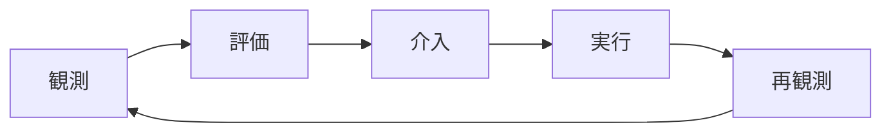
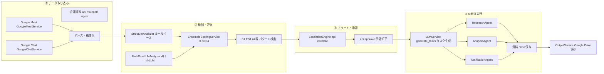
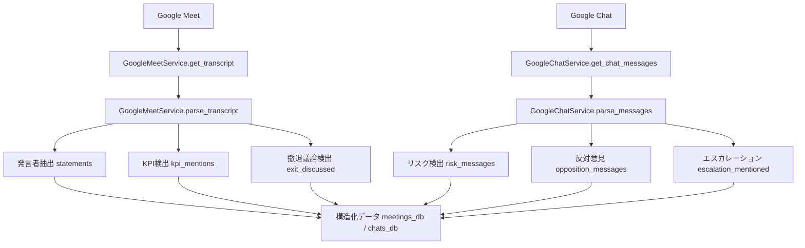
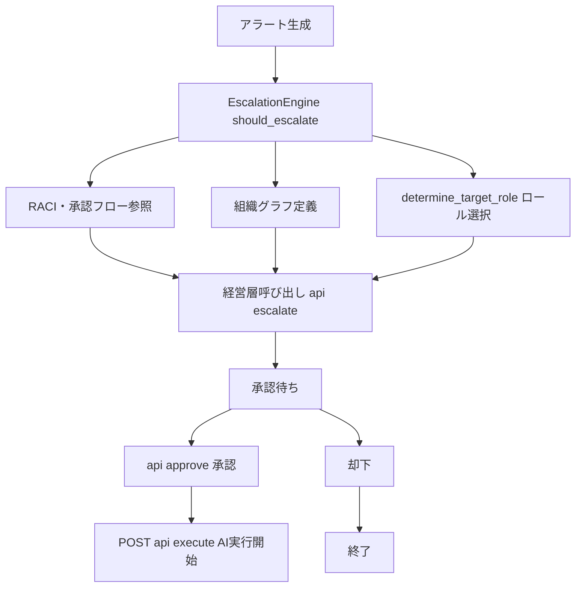
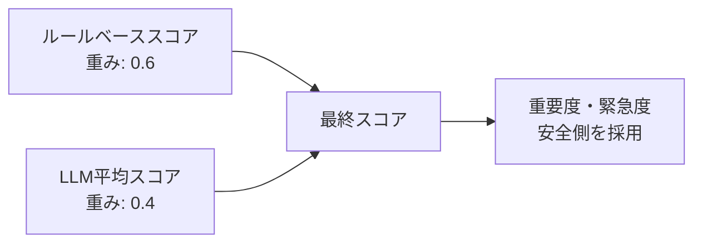

*Helmの価値とビジョン*

## はじめに

> **「AIを賢くするのではない。
> "人とAIでできた組織"を賢くする。」**

Helmは、**人の責任・判断・意思決定**に焦点を当てたAIエージェントです。既存のAIエージェントがタスクや成果物を最適化するのに対し、Helmは「誰が・いつ・どう判断するか」が曖昧で、意思決定が遅れたり歪んだりする問題を検知し、改善します。

#### サービスURL

とりあえず最初にモノを見たい方へ
@[card](https://v0-helm-pdca-demo.vercel.app/)

## 何ができるようになるの？

*人手による監視・判断 vs Helmによる自律支援*

### とある会議のケース：Helmによる変化

**従来**：経営会議ではCFOが数字を報告し、CEOは「戦略は間違っていない」と正当化。結論は「計画維持・3か月後に再報告」。一方、会議後のチャットでは「撤退案を口に出せる空気ではなかった」と本音が漏れているのに、それが会議には反映されない。→ 意思決定の遅延、過度な正当化、リソース浪費へ。
**Helm導入後**：会議議事録とチャットログをマルチ視点評価で分析し、問題を検知。スコアに基づきエスカレーションし、経営層が介入案を承認するとAIが自律実行。3週間後の経営会議では撤退案が議題に含まれ、CFOが「投資凍結オプション」の財務影響を具体的に言及するように。→ 意思決定のスピードアップ、軌道修正、リソース節約、早期撤退や成長の判断がしやすい組織へ。

## 背景・課題

私は、大企業でのAI戦略やAIの浸透をどのように実現するかの体制検討などを普段仕事にしていますが、
AIが社会・会社・組織に浸透していく真っ只中で、近い未来には個別のタスクや業務ではなく、意思決定の時間や経営判断の遅延が推進の最も大きなボトルネックとして挙げられて来ることを強く実感しています。

- **経験談**：いろんなAIツールでどんどん分析や示唆、資料は出てくるようになったけど、上司・経営層との会議手戻りが多く結局あまり工数改善されていない
- **調査事例**：パーソル総合研究所「無駄な社内会議による企業損失額調査」（2018年9月）によると、部長級管理職の週平均会議時間は**8.6時間**で、経営層のレビュー負荷は**週15時間**にも及びます[^5]。
  :::details 参考：Helmが解決する課題の調査事例
  従業員1,000名以上の企業では、以下の実データが報告されています。

**意思決定リードタイムの遅延**

株式会社IDEATECH「大企業・エンプラの意思決定プロセス実態調査」（2025年6月）によると、新規サービス導入の意思決定期間は、平均で**約4〜5ヶ月（120〜150日）**にのぼります[^1]。戦略的意思決定と新規事業の意思決定を平均すると、**平均意思決定リードタイムは70〜85日**となります。

**新規事業の高い失敗率**

- 株式会社スーパーソフトウエア「新規事業に関する実態調査」（2023年6月）：**6割以上（60%以上）が失敗**[^2]
- PwC Japan「新規事業開発の取り組みに関する実態調査2025年」（2025年11月）：投資回収まで至った企業は**約2割（20%）**のみ[^3]
- NTTデータ「なぜ81％の新規事業がグロースに失敗するのか？」（2024年9月）：**81%の事業が成長段階で失敗**[^4]
  :::

会社の中で「誰が何を判断するか」が問われる場面において、まだAIが活用できていない理由として、単にAIツールを入れても解決できない**人の責任・判断にまつわる問題**が存在します。

*3つの壁（責任曖昧・バイアス・人に頼る判断の限界）*

これは、「誰が判断するかが曖昧」「バイアス」「人に頼る判断の限界」の3つの壁を超えられるAIの設計が、今のツール群には存在していないからです。

### なぜ既存のツールやサービスでは解決できないのか

既存のAIツールやプロジェクト管理ツール（Asana、Jira、CrewAI、AutoGenなど）は、**タスクや成果物を最適化**することに焦点を当てています。

- **「誰が判断するか」が不明確**：重要な判断（撤退判断、仮説棄却など）の責任者が曖昧なまま。
- **「いつ判断すべきか」が分からない**：判断の遅れや責任の曖昧さの兆候を検知する仕組みがない
- **「判断の質」が向上しない**：誰が何を判断するか、いつ判断するかといった仕組みの改善が行われない

これらは、タスク管理や成果物の最適化では解決できず、**責任の所在や判断のタイミング・質を観測し、評価し、改善していく**ことが必要な問題です。

## どう解決するか

Helmは、**会議やチャットから「誰が・いつ・どう判断すべきか」の問題を検知し、適切な人に判断を促すシステム**です。従来の「人がAIを呼び出す」から「AIが人を呼び出す」へ転換することで、判断の遅れや責任の曖昧さなどを自動検知し、適切なタイミングで適切な人に判断を求める仕組みを実現します。

### Helmを構成する3つの中核機能

Helmでは、大きく3つの機能によって組織の意思決定を改善します。

#### ① 多角的な評価・判断システム

Helmは、**ルールベースとマルチ視点LLMを組み合わせたハイブリッド評価**により、見落としのない統合判断を実現します。

ルールベース分析では、KPI下方修正回数、撤退議論の有無、判断集中率（最も多く発言した人の発言数 / 総発言数）などの定量的指標に基づいて、安全側のベースライン評価を行います。一方、マルチ視点LLM分析では、同じ会議ログとチャットログを、4つの異なる視点から評価します：

- **経営者視点**：全社の業績・リスク・ステークホルダー責任の観点から評価
- **経営企画視点**：KPI・事業ポートフォリオ・撤退/投資判断の観点から評価
- **現場視点**：実行可能性と現場負荷の観点から評価
- **ガバナンス視点**：報告遅延・隠れたリスク・コンプライアンスの観点から評価

これらの評価結果をアンサンブルスコアリング（統合評価）で統合することで、単一の評価軸では見落としがちな問題も、複数の視点から検知できるようになります。重みづけや評価設計の詳細は、後半の「POINT：ルール×LLMによるハイブリッド評価」で説明します。

#### ② AIが人を呼び出し、判断を依頼

判断の遅れや責任の曖昧さなどを検知すると、Helmは自動で**役員 / 部長 / スタッフ**を特定し、判断・承認を依頼します。

人がAIを監視するのではなく、**AIが会議やチャットの状況を監視し、必要なときに人に判断を求める**という逆転の発想を実現しています。責任モデル（「誰がどの判断に責任を持つか」を定義したモデル）に基づいて適切なロールを決定し、「なぜこの人に判断を求めるべきか」を説明できる形で生成します。

#### ③ 学習・改善PDCAの自動化

Helmは、以下のループを自動で回します：

**どんなときに判断が遅れやすいか、責任が曖昧になりやすいか**を学習し、時間とともに**判断の仕組みそのものが改善されていく**仕組みを実現します。例えば、Helmが検知した問題に対して経営層が介入し、その結果を次のサイクルで再観測することで、「誰が・いつ・どう判断するか」が継続的に改善されていきます。

## リスクとガバナンス設計

会議・チャットを継続的にモニタリングして介入する以上、技術より先に「正当性」「監査可能性」「濫用防止」を設計する必要があります。Helmでは次のような前提を置いています。

- **取得範囲**: 対象は「特定プロジェクトの定例会議」「特定ワークスペースのチャット」に限定し、全社横断の“全監視”は行わない
- **同意・告知**: 対象会議／スペースには「Helmがログを分析しています」を明示し、ポリシーに同意したメンバーのみ参加する
- **保存・権限**: ログは一定期間で自動削除し、マスキング（個人名・機微情報）を施した上で、アクセス権限を経営企画・ガバナンス担当などに限定する
- **誤検知への対応**: 「このアラートは不要だった」をワンクリックでフィードバックでき、その結果をモデル・ルールの改善に反映する

これらを前提に、「意思決定ガバナンスの最適化」が“組織にとって正当な介入”になるよう設計しています。

:::message
ここからは実装やアーキテクチャについて詳しく解説します。
:::

## どんな仕組みで実現するか

### ステップ1：データ取り込み

Google Meet / Chat / 会議資料から議事録・ログを取得し、構造化します。

Google Meet APIから議事録を取得し、発言者抽出、KPI検出、撤退議論検出、リスク検出などのパース処理を実行し、JSONの構造化データに変換します。

> 前提条件メモ（Google Meet / Chat）
>
> - Meetの文字起こしは、会議側でトランスクリプト機能を有効にしている前提でAPIから取得します（利用可能なエディション／設定に依存）
> - Chatメッセージ取得は、対象スペース／スレッドに対する適切なスコープを持つサービスアカウントを前提とします
> - 本記事では取得方法の詳細には踏み込みませんが、「どの会議・どのスペースを対象にするか」というスコープ設計・権限設計が実運用では重要になります

### ステップ2：検知・評価

ルールベース＋マルチLLMで問題特定を行います。

ルールベース分析では、KPI下方修正回数、撤退議論の有無、判断集中率などの定量的指標に基づいて、判断の遅れや責任の曖昧さに繋がる問題を検知します。マルチ視点LLM分析では、4つのロール視点（経営者、経営企画、現場、ガバナンス）から同一データを評価し、アンサンブルスコアリングで統合します。
このスコアの結果をもとに、評価を事前に用意されているパターンに割り当て、アラートを作成します（※パターン設計については検討中につき変更可能性あり）。ハイブリッド評価の設計思想や重みづけの詳細は、後半の「POINT：ルール×LLMによるハイブリッド評価」を参照してください。

*データ取り込み → 検知・評価 → アラート → AI自律実行*

### ステップ3：アラート発行

責任モデル（「誰がどの判断に責任を持つか」を定義したモデル）に基づき、AIが人を呼び出します。

判断の遅れや責任の曖昧さなどが検知されると、Helmは自動的に適切なロール（経営層など）を決定し、エスカレーション理由を生成します。

> 補足：組織グラフ・RACI・承認フロー
>
> 組織グラフ・RACI・承認フローは **JSON定義で賄っている**。`config/definitions/` に org_graph、raci、approval_flows を置き、EscalationEngine が ResponsibilityResolver 経由で「どのロールに上げるか」「どの承認フローを使うか」を決める。承認はテンプレートに基づく多段階（例：投資凍結＝CFO承認→経営層承認）まで対応。定義が無い場合は経営層・1回承認でフォールバックする。永続化・共有は Firestore を想定した設計で、現状はファイルベース。

### ステップ4：AI自律実行

タスク分解、資料作成、会議設定まで実行します。

経営層の承認後、HelmはADK（Agent Development Kit）を使用したマルチエージェントシステムで自律的にタスクを実行します。具体的には、市場データ分析、社内データ統合、3案比較資料の自動生成、関係部署への事前通知、会議アジェンダの更新などを行います。

### アーキテクチャ設計

#### システム全体図

ビジネス上の流れを一覧で示した図です。左から右へ「データ取り込み → 検知・評価 → アラート → 承認 → AI実行 → 保存」の順で進みます。

| 段階 | 主なAPI・サービス                                                                                                           |
| ---- | --------------------------------------------------------------------------------------------------------------------------- |
| ①   | `POST /api/meetings/ingest`, `POST /api/chat/ingest`, `POST /api/materials/ingest`                                    |
| ②   | `POST /api/analyze`（StructureAnalyzer + MultiRoleLLMAnalyzer + EnsembleScoringService）                                  |
| ③   | `POST /api/escalate`, `POST /api/approve`（EscalationEngine）                                                           |
| ④   | `POST /api/execute`（LLMタスク生成 → ADKエージェント実行）、`WebSocket /api/execution/{id}/ws`（進捗リアルタイム配信） |

---

### 各フロー詳細

#### 1. データ取り込みフロー

**API**: `POST /api/meetings/ingest`, `POST /api/chat/ingest`, `POST /api/materials/ingest`

| ツール・サービス            | 役割                                                                |
| --------------------------- | ------------------------------------------------------------------- |
| **GoogleMeetService** | 議事録取得（`get_transcript`）、パース（`parse_transcript`）    |
| **GoogleChatService** | チャット取得（`get_chat_messages`）、パース（`parse_messages`） |

議事録パースでは発言者抽出・KPI検出・撤退議論検出、チャットパースではリスク検出・エスカレーション検出・反対意見検出を行い、構造化データとして保持します。

#### 詳細

#### 2. 判断・責任にまつわる問題の検知フロー（マルチ視点評価システム）

**API**: `POST /api/analyze`

| ツール・サービス                 | 役割                                                                           |
| -------------------------------- | ------------------------------------------------------------------------------ |
| **StructureAnalyzer**      | ルールベース分析（KPI下方修正回数、撤退議論の有無、判断集中率、反対意見無視）  |
| **MultiRoleLLMAnalyzer**   | 4ロール（executive / corp_planning / staff / governance）で同一データをLLM評価 |
| **EnsembleScoringService** | 0.6×ルール + 0.4×LLM で統合、重要度・緊急度は安全側を採用                    |
| **ScoringService**         | 各 finding の重要度・緊急度評価                                                |
| **OutputService**          | 分析結果の保存（`save_analysis_result`）                                     |

**検出パターン例**: B1_正当化フェーズ、ES1_報告遅延、A2_撤退判断の遅れ（LLM検出）

#### 3. 経営層の呼び出しフロー

**API**: `POST /api/escalate`, `POST /api/approve`

| ツール・サービス                                                 | 役割                                                                                                                                                    |
| ---------------------------------------------------------------- | ------------------------------------------------------------------------------------------------------------------------------------------------------- |
| **EscalationEngine**                                       | `should_escalate`（閾値・重要度で判断）、`determine_target_role`（ロール選択）、`generate_escalation_reason`（理由生成）                          |
| 責任モデル・組織グラフ（RACI／報告関係／承認フローテンプレート） | JSON定義（org_graph / raci / approval_flows）を DefinitionLoader・ResponsibilityResolver・ApprovalFlowEngine が読み、EscalationEngine と approve で利用 |

#### 4. AI自律実行フロー（ADKエージェント）

**API**: `POST /api/execute`, `WebSocket /api/execution/{id}/ws`（進捗リアルタイム配信）

| ツール・サービス                    | 役割                                                                                                   |
| ----------------------------------- | ------------------------------------------------------------------------------------------------------ |
| **LLMService.generate_tasks** | 承認内容からタスクリストを生成（research / analysis / notification / document 等）                     |
| **TaskWorkflowAgent**         | タスク依存解決と実行順制御、SharedContext でエージェント間共有                                         |
| **ResearchAgent**             | `search_market_data`, `analyze_market_data`（将来: Vertex AI Search）                              |
| **AnalysisAgent**             | `fetch_internal_data`, `perform_financial_simulation`（将来: Google Drive API）                    |
| **NotificationAgent**         | `generate_notification_message`, `send_notification`（Phase1: ドラフトのみ、将来: Chat/Gmail API） |
| **GoogleWorkspaceService**    | `research_market_data`, `analyze_data`, `create_document`（資料作成）                            |
| **GoogleDriveService**        | `save_file`, ダウンロードURL取得                                                                     |
| **OutputService**             | `save_task_generation_result`、結果JSON保存                                                          |

#### 詳細

**アーキテクチャの詳細は以下で公開しています。**

@[card](https://github.com/killertcell428/Helm/blob/main/ARCHITECTURE.md)

### 技術スタック

| カテゴリ                   | 技術                         | 選定理由                                                                                                       | 具体的活用方法                                                                                                                                                                                                      |
| -------------------------- | ---------------------------- | -------------------------------------------------------------------------------------------------------------- | ------------------------------------------------------------------------------------------------------------------------------------------------------------------------------------------------------------------- |
| **フロントエンド**   | Next.js 16.x                 | Reactベースのフレームワークで、SSRとSSGをサポート。デモページの高速表示を実現                                  | Case1/Case2/Case3のデモページを構築。API Client（lib/api.ts）でバックエンドと通信（実装は Next.js 16.0.x）                                                                                                          |
|                            | TypeScript                   | 型安全性の確保により、開発時のエラーを早期発見                                                                 | APIレスポンスの型定義、コンポーネントの型安全性を確保                                                                                                                                                               |
|                            | Tailwind CSS                 | ユーティリティファーストのCSSフレームワークで、迅速なUI開発を実現                                              | デモページのスタイリング、レスポンシブデザインの実装                                                                                                                                                                |
| **バックエンド**     | FastAPI                      | PythonベースのAPIフレームワークで、非同期処理とWebSocketをサポート                                             | REST APIエンドポイント（/api/meetings/ingest, /api/analyze等）とWebSocketエンドポイント（/api/execution/{execution_id}/ws）を実装                                                                                   |
|                            | Python 3.11+                 | 主要なプログラミング言語。型ヒントとパフォーマンス改善を活用                                                   | サービス層の実装、LLM統合、データ処理                                                                                                                                                                               |
|                            | Uvicorn                      | ASGIサーバーで、FastAPIの非同期処理をサポート                                                                  | 本番環境でのAPIサーバーとして使用                                                                                                                                                                                   |
| **AI/ML**            | Gemini（Gen AI SDK）         | Google の生成AIモデル。ライブラリは google-generativeai（Gen AI SDK）。モデルは環境変数で指定                  | 分析・タスク生成はデフォルトで**Gemini 3 Flash**（`LLM_MODEL`で変更可）。ADKエージェントはデフォルトで **Gemini 2.0 Flash**（`ADK_MODEL`で変更可）。マルチ視点LLM分析・タスク生成・説明文生成に利用 |
| **データ・定義**     | JSON定義 / Firestore（設計） | 組織グラフ・RACI・承認フローは `config/definitions/` の JSON で管理。永続化・共有は Firestore を想定した設計 | 組織グラフ（報告関係）・RACI・承認フローテンプレートはファイルで管理。検知記録・エスカレーション履歴の永続化は設計段階                                                                                              |
|                            | BigQuery                     | データウェアハウス。時系列データ分析とメトリクス集計に最適                                                     | 時系列データ分析、メトリクス集計、長期トレンド分析                                                                                                                                                                  |
| **Google Cloud統合** | Google Meet API              | 議事録取得に使用                                                                                               | 会議議事録の取得、発言者抽出、KPI検出                                                                                                                                                                               |
|                            | Google Chat API              | チャットメッセージ取得に使用                                                                                   | チャットログの取得、本音の兆候検出                                                                                                                                                                                  |
|                            | Google Workspace API         | 資料生成と通知送信に使用                                                                                       | 資料ドラフト作成、関係者への通知送信                                                                                                                                                                                |
|                            | Google Drive API             | ファイル保存と共有に使用                                                                                       | 生成された資料の保存、ダウンロードURL生成                                                                                                                                                                           |
| **リアルタイム通信** | WebSocket                    | リアルタイム進捗更新に使用                                                                                     | AI自律実行中の進捗をリアルタイムで配信                                                                                                                                                                              |

## 運用・非機能要件（スケール/将来実装）

本記事では主にアーキテクチャとLLMまわりにフォーカスしていますが、実際にHelmを運用していく上では次のような非機能要件も重要になります。

- **認証・認可**: 誰がHelmを実行できるか（ロールベースのアクセス制御）、どの会議／チャットにアクセスできるか
- **テナント分離**: 事業部・グループ会社ごとのデータ分離、組織ごとのポリシー設定
- **ジョブ管理**: 長時間かかる分析・タスク実行のキューイング、再実行、キャンセル
- **再実行・冪等性**: 同じ会議ログに対して分析をやり直したときに、重複タスクや二重アラートが発生しないようにする
- **監査ログ**: 「いつ・誰に対して・どんなアラート／タスクを出したか」が後から追えるような監査証跡

### 現状の実装状況

認証は API Key＋ロールで制御し、監査ログは `GET /api/audit/logs` で取得できる。
データ保存期間と自動削除は `POST /api/admin/retention/cleanup`、execute は同一 approval_id で冪等に返す。
誤検知フィードバック・精度指標API、取得範囲ホワイトリスト・サプレッションも簡易レベルで組み込んでいる。(ここでは省略)
マルチテナント、ジョブキュー、通知ポリシー、オーナーシップモデルは設計段階。

### POINT：ルール×LLMによるハイブリッド評価

Helmは、ルールベース分析とマルチ視点LLM分析を組み合わせたハイブリッド評価により、**判断の遅れや責任の曖昧さ**といった問題を、より信頼性高く検知できるようにしています。なぜこの2つを組み合わせる必要があるのか、それぞれの限界と利点を説明します。

#### ルールベースの限界と利点

ルールベース分析は、定量的指標（KPI下方修正回数、撤退議論の有無、判断集中率など）に基づいて、判断の遅れや責任の曖昧さに繋がる問題を検知します。これは安全側のベースラインとして機能し、**見逃しゼロの安全網**を提供します。

しかし、ルールベース分析には限界があります。数値は正常だが「空気が異常」を見逃す可能性があります。例えば、会議の数値は正常範囲内でも、チャットログから「撤退案を口に出せる空気じゃない」という本音が漏れている場合、ルールベースだけでは検知できません。

#### LLM単体の限界と利点

マルチ視点LLM分析は、4つのロール視点から同一データを評価することで、文脈理解により過剰反応を抑制します。

- **経営者視点（重み: 0.4）**: 全社の業績・リスク・ステークホルダー責任の観点から評価
- **経営企画視点（重み: 0.3）**: KPI・事業ポートフォリオ・撤退/投資判断の観点から評価
- **現場視点（重み: 0.2）**: 実行可能性と現場負荷の観点から評価
- **ガバナンス視点（重み: 0.1）**: 報告遅延・隠れたリスク・コンプライアンスの観点から評価

しかし、LLM単体にも限界があります。楽観バイアス・ハルシネーションのリスクがあり、過剰なアラートを発する可能性があります。

#### 結論：アンサンブルスコアリング

*0.6×ルール + 0.4×LLM で信頼性の高い検知*
Helmは、ルールベース結果とLLM結果を統合することで、より保守的で信頼性の高い評価を実現します：

- **スコア計算**: 0.6 × ルールベーススコア + 0.4 × LLM平均スコア
- **重要度・緊急度**: 安全側（最も強い）を採用（過小評価を避けるため）
- **説明文**: ルールベースの説明と主要ロールのコメントを統合

重要度・緊急度は、ルールベースと各ロールの結果のうち、**最も安全側（最も強い）の評価を強制採用**します。これにより、過小評価を避け、かつ過剰なアラートも避けるバランスを取っています。

0.6／0.4 という重みは、「まずはルール（定量指標）をやや重く見る」という安全側の初期値です。実際の導入では、過去会議ログを教師データ化し、

- どのパターンでアラートを出したかったか（ラベル付け）
- 誤検知・見逃しのコスト

を元に、各社ごとに重みやしきい値を校正していく想定です。

また、「常に安全側の評価を採用する」設計は、短期的には見逃し防止に有効ですが、そのまま運用すると**アラート疲れ**を招きます。Helmでは次のような運用設計を前提にしています。

- **精度指標のモニタリング**: Precision / Recall を追い、過剰アラートになっていないか定期的に検証する（`GET /api/metrics/accuracy` で取得、誤検知は `POST /api/feedback/false-positive` で登録）
- **サプレッション**: 同種のアラートが一定時間内に繰り返し出た場合は、1件にまとめて通知する（パターンID＋リソース単位の抑制設定で制御）
- **ロール別の通知ポリシー**: 経営層には「本当にヤバいもの」だけを通知し、詳細は経営企画・ガバナンスチームでレビューする
- **閾値調整**: 組織ごとに受容できるリスクに応じて、安全側の度合い（ルール／LLMのしきい値）を調整できる

## 将来展望

*複数領域への横展開と、AIが自動生成する「AI会社パッケージ」を目指しています*

## まとめ

Helmは、**意思決定ガバナンスの最適化**に焦点を当てたAIエージェントとして、以下の特徴を持ちます：

1. **AIが人を呼び出す**: 判断の遅れや責任の曖昧さなどを検知すると、自動的に適切なロール（経営層など）を呼び出す
2. **多角的評価**: ルールベース × LLM のハイブリッド評価で、4つの視点（経営者、経営企画、現場、ガバナンス）から同時評価
3. **学習・改善PDCA**: 観測→評価→介入→実行→再観測のループを自動化し、「誰が・いつ・どう判断するか」が継続的に改善されていく
4. **判断の仕組みの改善**: タスクや成果物ではなく、「誰が何を判断するか」「いつ判断すべきか」「判断の質」を観測・評価・改善する

Helmのビジョンは、**"Helm is where humans steer and AI rows."**です。

人は舵を取る。AIは船でありパドルでありレーダーである。

これは、既存の「人がAIを呼び出す」でも「完全自動化」でもない、**新しいヒト×AIの共生関係**です。

:::message
**「AIを賢くするのではない。**
**"人とAIでできた組織"を賢くする。」**
:::

---

## 参考資料

**GitHubリポジトリ（ソースコード・README）**

@[card](https://github.com/killertcell428/Helm)

**アーキテクチャドキュメント（システム設計の詳細）**

@[card](https://github.com/killertcell428/Helm/blob/main/ARCHITECTURE.md)

**その他ドキュメント一覧**

@[card](https://github.com/killertcell428/Helm/blob/main/DOCUMENTATION_INDEX.md)

[^5]: https://rc.persol-group.co.jp/news/201809060935/
    
[^1]: https://prtimes.jp/main/html/rd/p/000000421.000045863.html
    
[^2]: https://prtimes.jp/main/html/rd/p/000000023.000004742.html
    
[^3]: https://www.pwc.com/jp/ja/knowledge/thoughtleadership/new-business-development-survey-2025.html
    
[^4]: https://www.nttdata.com/jp/ja/trends/event/archive/2024/097
