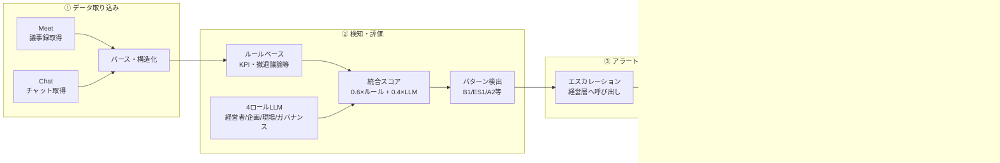

*Helmの価値とビジョン*

## はじめに

> **「AIを賢くするのではない。
> "人とAIでできた組織"を賢くする。」**

Helmは、**人の責任・判断・意思決定**に焦点を当てたAIエージェントです。既存のAIエージェントがタスクや成果物を最適化するのに対し、Helmは「誰が・いつ・どう判断するか」が曖昧で、意思決定が遅れたり歪んだりする問題を検知し、改善します。

### 審査POINT
**新規性**：組織の意思決定プロセスをAIが能動的に監視し、独自の評価システムにより問題が発生するとアラートを作成。「AIが人を呼び出す」という既存のタスク自動化型のエージェントとは逆転の設計によりこれまで手が付けられていない組織の課題を解決。  
**完成度**：データ取り込み→検知・評価→アラート→承認→AI自律実行まで一通り実装済み。検知・評価・エスカレーションのコアは動作中。ADKは3月中に実API統合を予定。
**プロダクト原則（監視ツールではない）**：取得範囲は特定プロジェクト・ワークスペースに限定。同意・告知を明示し、匿名化・保持期間・監査・誤検知時の責任境界を設計済み。詳細は後述の「＋α：リスクとガバナンス設計」を参照。

#### サービスURL

とりあえず最初にモノを見たい方へ
@[card](https://v0-helm-pdca-demo.vercel.app/)

## 何ができるようになるの？

*人手による監視・判断 vs Helmによる自律支援*

### とある会議のケース：Helmによる変化

**従来**：経営会議ではCFOが数字を報告し、CEOは「戦略は間違っていない」と正当化。結論は「計画維持・3か月後に再報告」。一方、会議後のチャットでは「撤退案を口に出せる空気ではなかった」と本音が漏れているのに、それが会議には反映されない。→ 意思決定の遅延、過度な正当化、リソース浪費へ。
**Helm導入後**：会議議事録とチャットログをマルチ視点評価で分析し、問題を検知。スコアに基づきエスカレーションし、経営層が介入案を承認するとAIが自律実行。3週間後の経営会議では撤退案が議題に含まれ、CFOが「投資凍結オプション」の財務影響を具体的に言及するように。→ 意思決定のスピードアップ、軌道修正、リソース節約、早期撤退や成長の判断がしやすい組織へ。

**デモ導線（30秒で理解）**：入力（会議＋チャット）→ 検知・評価 → アラート → 承認 → AI自律実行（資料作成・通知）→ 保存。Case1/2/3のデモで「誰が呼ばれるか」「何が変わるか」を体験できます。**体験価値**：たった1つの介入で救われる例として、撤退判断の早期化、リスク報告の漏れ防止、炎上未然防止などが想定されています。

## 背景・課題

私は、大企業でのAI戦略やAIの浸透をどのように実現するかの体制検討などを普段仕事にしていますが、
AIが社会・会社・組織に浸透していく真っ只中で、近い未来には個別のタスクや業務ではなく、意思決定の時間や経営判断の遅延が推進の最も大きなボトルネックとして挙げられて来ることを強く実感しています。

- **経験談**：いろんなAIツールでどんどん分析や示唆、資料は出てくるようになったけど、上司・経営層との会議手戻りが多く結局あまり工数改善されていない
- **調査事例**：パーソル総合研究所「無駄な社内会議による企業損失額調査」（2018年9月）によると、部長級管理職の週平均会議時間は**8.6時間**で、経営層のレビュー負荷は**週15時間**にも及びます[^5]。
  :::details 参考：Helmが解決する課題の調査事例
  従業員1,000名以上の企業では、以下の実データが報告されています。
  **意思決定リードタイムの遅延**
  株式会社IDEATECH「大企業・エンプラの意思決定プロセス実態調査」（2025年6月）によると、新規サービス導入の意思決定期間は、平均で**約4〜5ヶ月（120〜150日）**にのぼります[^1]。戦略的意思決定と新規事業の意思決定を平均すると、**平均意思決定リードタイムは70〜85日**となります。

  **新規事業の高い失敗率**
  - 株式会社スーパーソフトウエア「新規事業に関する実態調査」（2023年6月）：**6割以上（60%以上）が失敗**[^2]
  - PwC Japan「新規事業開発の取り組みに関する実態調査2025年」（2025年11月）：投資回収まで至った企業は**約2割（20%）**のみ[^3]
  - NTTデータ「なぜ81％の新規事業がグロースに失敗するのか？」（2024年9月）：**81%の事業が成長段階で失敗**[^4]
  :::

会社の中で「誰が何を判断するか」が問われる場面において、まだAIが活用できていない理由として、単にAIツールを入れても解決できない**人の責任・判断にまつわる問題**が存在します。

*3つの壁（責任曖昧・バイアス・人に頼る判断の限界）*

これは、「誰が判断するかが曖昧」「バイアス」「人に頼る判断の限界」の3つの壁を超えられるAIの設計が、今のツール群には存在していないからです。

### なぜ既存のツールやサービスでは解決できないのか

既存のAIツールやプロジェクト管理ツール（Asana、Jira、CrewAI、AutoGenなど）は、**タスクや成果物を最適化**することに焦点を当てています。

- **「誰が判断するか」が不明確**：重要な判断（撤退判断、仮説棄却など）の責任者が曖昧なまま。
- **「いつ判断すべきか」が分からない**：判断の遅れや責任の曖昧さの兆候を検知する仕組みがない
- **「判断の質」が向上しない**：誰が何を判断するか、いつ判断するかといった仕組みの改善が行われない

これらは、タスク管理や成果物の最適化では解決できず、**責任の所在や判断のタイミング・質を観測し、評価し、改善していく**ことが必要な問題です。

## どう解決するか

Helmは、**会議やチャットから「誰が・いつ・どう判断すべきか」の問題を検知し、適切な人に判断を促すシステム**です。従来の「人がAIを呼び出す」から「AIが人を呼び出す」へ転換することで、判断の遅れや責任の曖昧さなどを自動検知し、適切なタイミングで適切な人に判断を求める仕組みを実現します。

Helmでは、大きく3つの機能によって組織の意思決定を改善します。

### ① 多角的な評価・判断システム

Helmは、**ルールベースとマルチ視点LLMを組み合わせたハイブリッド評価**により、見落としのない統合判断を実現します。

ルールベース分析では、KPI下方修正回数、撤退議論の回数などの定量的指標に基づいて、安全側のベースライン評価を行います。一方、マルチ視点LLM分析では、同じ会議ログとチャットログを、4つの異なる視点から評価します：

- **経営者視点**：全社の業績・リスク・ステークホルダー責任の観点から評価
- **経営企画視点**：KPI・事業ポートフォリオ・撤退/投資判断の観点から評価
- **現場視点**：実行可能性と現場負荷の観点から評価
- **ガバナンス視点**：報告遅延・隠れたリスク・コンプライアンスの観点から評価

これらの評価結果をアンサンブルスコアリング（統合評価）で統合することで、単一の評価軸では見落としがちな問題も、複数の視点から検知できるようになります。重みづけや評価設計の詳細は、後半の「POINT：ルール×LLMによるハイブリッド評価」で説明します。

### ② AIが人を呼び出し、判断を依頼

判断の遅れや責任の曖昧さなどを検知すると、Helmは自動で**役員 / 部長 / スタッフ**を特定し、判断・承認を依頼します。

人がAIを監視するのではなく、**AIが会議やチャットの状況を監視し、必要なときに人に判断を求める**という逆転の発想を実現しています。責任モデル（「誰がどの判断に責任を持つか」を定義したモデル）に基づいて適切なロールを決定し、「なぜこの人に判断を求めるべきか」を説明できる形で生成します。

### ③ 学習・改善PDCAの自動化

Helmは、以下のループを自動で回します：

**どんなときに判断が遅れやすいか、責任が曖昧になりやすいか**を学習し、時間とともに**判断の仕組みそのものが改善されていく**仕組みを実現します。例えば、Helmが検知した問題に対して経営層が介入し、その結果を次のサイクルで再観測することで、「誰が・いつ・どう判断するか」が継続的に改善されていきます。

### ＋α：リスクとガバナンス設計

会議・チャットを継続的にモニタリングして介入する以上、技術より先に「正当性」「監査可能性」「濫用防止」を設計する必要があります。Helmでは次のような前提を置いています。

- **取得範囲**: 対象は「特定プロジェクトの定例会議」「特定ワークスペースのチャット」に限定し、全社横断の“全監視”は行わない
- **同意・告知**: 対象会議／スペースには「Helmがログを分析しています」を明示し、ポリシーに同意したメンバーのみ参加する
- **保存・権限**: ログは一定期間で自動削除し、マスキング（個人名・機微情報）を施した上で、アクセス権限を経営企画・ガバナンス担当などに限定する
- **誤検知への対応**: 「このアラートは不要だった」をワンクリックでフィードバックでき、その結果をモデル・ルールの改善に反映する

これらを前提に、「意思決定ガバナンスの最適化」が“組織にとって正当な介入”になるよう設計しています。

:::message
ここからは実装やアーキテクチャについて詳しく解説します。
:::

## どんな仕組みで実現するか

### ステップ1：データ取り込み

Google Meet / Chat / 会議資料から議事録・ログを取得し、構造化します。

Google Meet APIから議事録を取得し、発言者抽出、KPI検出、撤退議論検出、リスク検出などのパース処理を実行し、JSONの構造化データに変換します。

:::details 補足：データ取得の条件（Google Meet / Chat）
- Meetの文字起こしは、会議側でトランスクリプト機能を有効にしている前提でAPIから取得
- Chatメッセージ取得は、対象スペース／スレッドに対する適切なスコープを持つサービスアカウント前提
- 本記事では取得方法の詳細には踏み込みませんが、「どの会議・どのスペースを対象にするか」というスコープ設計・権限設計が実運用では重要
:::

### ステップ2：検知・評価

ルールベース＋マルチLLMで問題特定を行います。

ルールベース分析では、KPI下方修正回数、撤退議論の有無、判断集中率などの定量的指標に基づいて、判断の遅れや責任の曖昧さに繋がる問題を検知します。マルチ視点LLM分析では、4つのロール視点（経営者、経営企画、現場、ガバナンス）から同一データを評価し、アンサンブルスコアリングで統合します。
このスコアの結果をもとに、評価を事前に用意されているパターンに割り当て、アラートを作成します（※パターン設計については検討中につき変更可能性あり）。ハイブリッド評価の設計思想や重みづけの詳細は、後半の「POINT：ルール×LLMによるハイブリッド評価」を参照してください。

### ステップ3：アラート発行

責任モデル（「誰がどの判断に責任を持つか」を定義したモデル）に基づき、AIが人を呼び出します。

判断の遅れや責任の曖昧さなどが検知されると、Helmは自動的に適切なロール（経営層など）を決定し、エスカレーション理由を生成します。

:::details 補足：組織グラフ・RACI・承認フロー
組織グラフ・RACI・承認フローは **JSON定義で賄っている**。
`config/definitions/` に org_graph、raci、approval_flows を置き、EscalationEngine が ResponsibilityResolver 経由で「どのロールに上げるか」「どの承認フローを使うか」を決める。承認はテンプレートに基づく多段階（例：投資凍結＝CFO承認→経営層承認）まで対応。定義が無い場合は経営層・1回承認でフォールバックする。永続化・共有は Firestore を想定した設計で、現状はファイルベース。
:::

### ステップ4：AI自律実行

タスク分解、資料作成、会議設定まで実行します。

経営層の承認後、HelmはADK（Agent Development Kit）を使用したマルチエージェントシステムで自律的にタスクを実行します。具体的には、市場データ分析、社内データ統合、3案比較資料の自動生成、関係部署への事前通知、会議アジェンダの更新などを行います。

### アーキテクチャ設計

#### システム全体図

ビジネス上の流れを一覧で示した図です。左から右へ「データ取り込み → 検知・評価 → アラート → 承認 → AI実行 → 保存」の順で進みます。

*図：Helmのビジネスフロー全体。左から右へ データ取り込み→検知・評価→アラート・承認→AI自律実行*

---

### 各フロー詳細

#### 1. データ取り込みフロー

*図：Meet/Chatから取得→パース→項目抽出→構造化データとして保存*

| ツール・サービス            | 役割                                                                |
| --------------------------- | ------------------------------------------------------------------- |
| **GoogleMeetService** | 議事録取得（`get_transcript`）、パース（`parse_transcript`）    |
| **GoogleChatService** | チャット取得（`get_chat_messages`）、パース（`parse_messages`） |

議事録パースでは発言者抽出・KPI検出・撤退議論検出、チャットパースではリスク検出・エスカレーション検出・反対意見検出を行い、構造化データとして保持します。

#### 2. 判断・責任にまつわる問題の検知フロー（マルチ視点評価システム）

| ツール・サービス                 | 役割                                                                           |
| -------------------------------- | ------------------------------------------------------------------------------ |
| **StructureAnalyzer**      | ルールベース分析（KPI下方修正回数、撤退議論の有無、判断集中率、反対意見無視）  |
| **MultiRoleLLMAnalyzer**   | 4ロール（executive / corp_planning / staff / governance）で同一データをLLM評価 |
| **EnsembleScoringService** | 0.6×ルール + 0.4×LLM で統合、重要度・緊急度は安全側を採用                    |
| **ScoringService**         | 各 finding の重要度・緊急度評価                                                |
| **OutputService**          | 分析結果の保存（`save_analysis_result`）                                     |

#### 3. 経営層の呼び出しフロー

*図：アラート→判定→定義参照→経営層呼び出し→承認/却下→AI実行*

| ツール・サービス                                                 | 役割                                                                                                                                                    |
| ---------------------------------------------------------------- | ------------------------------------------------------------------------------------------------------------------------------------------------------- |
| **EscalationEngine**                                       | `should_escalate`（閾値・重要度で判断）、`determine_target_role`（ロール選択）、`generate_escalation_reason`（理由生成）                          |
| 責任モデル・組織グラフ（RACI／報告関係／承認フローテンプレート） | JSON定義（org_graph / raci / approval_flows）を DefinitionLoader・ResponsibilityResolver・ApprovalFlowEngine が読み、EscalationEngine と approve で利用 |

#### 4. AI自律実行フロー（ADKエージェント）

*図：承認後→タスク作成→4エージェント並列実行→結果保存*

| ツール・サービス                    | 役割                                                                                                   |
| ----------------------------------- | ------------------------------------------------------------------------------------------------------ |
| **LLMService.generate_tasks** | 承認内容からタスクリストを生成（research / analysis / notification / document 等）                     |
| **TaskWorkflowAgent**         | タスク依存解決と実行順制御、SharedContext でエージェント間共有                                         |
| **ResearchAgent**             | `search_market_data`, `analyze_market_data`（将来: Vertex AI Search）                              |
| **AnalysisAgent**             | `fetch_internal_data`, `perform_financial_simulation`（将来: Google Drive API）                    |
| **NotificationAgent**         | `generate_notification_message`, `send_notification`（Phase1: ドラフトのみ、将来: Chat/Gmail API） |
| **GoogleWorkspaceService**    | `research_market_data`, `analyze_data`, `create_document`（資料作成）                            |
| **GoogleDriveService**        | `save_file`, ダウンロードURL取得                                                                     |
| **OutputService**             | `save_task_generation_result`、結果JSON保存                                                          |

### 技術スタック

| カテゴリ                   | 技術                         | 選定理由                                                                                                       | 具体的活用方法                                                                                                                                                                                                      |
| -------------------------- | ---------------------------- | -------------------------------------------------------------------------------------------------------------- | ------------------------------------------------------------------------------------------------------------------------------------------------------------------------------------------------------------------- |
| **フロントエンド**   | Next.js 16.x                 | Reactベースのフレームワークで、SSRとSSGをサポート。デモページの高速表示を実現                                  | Case1/Case2/Case3のデモページを構築。API Client（lib/api.ts）でバックエンドと通信（実装は Next.js 16.0.x）                                                                                                          |
|                            | TypeScript                   | 型安全性の確保により、開発時のエラーを早期発見                                                                 | APIレスポンスの型定義、コンポーネントの型安全性を確保                                                                                                                                                               |
|                            | Tailwind CSS                 | ユーティリティファーストのCSSフレームワークで、迅速なUI開発を実現                                              | デモページのスタイリング、レスポンシブデザインの実装                                                                                                                                                                |
| **バックエンド**     | FastAPI                      | PythonベースのAPIフレームワークで、非同期処理とWebSocketをサポート                                             | REST APIエンドポイント（/api/meetings/ingest, /api/analyze等）とWebSocketエンドポイント（/api/execution/{execution_id}/ws）を実装                                                                                   |
|                            | Python 3.11+                 | 主要なプログラミング言語。型ヒントとパフォーマンス改善を活用                                                   | サービス層の実装、LLM統合、データ処理                                                                                                                                                                               |
|                            | Uvicorn                      | ASGIサーバーで、FastAPIの非同期処理をサポート                                                                  | 本番環境でのAPIサーバーとして使用                                                                                                                                                                                   |
| **AI/ML**            | Gemini（Gen AI SDK）         | Google の生成AIモデル。ライブラリは google-generativeai（Gen AI SDK）。モデルは環境変数で指定                  | 分析・タスク生成はデフォルトで**Gemini 3 Flash**（`LLM_MODEL`で変更可）。ADKエージェントはデフォルトで **Gemini 2.0 Flash**（`ADK_MODEL`で変更可）。マルチ視点LLM分析・タスク生成・説明文生成に利用 |
| **データ・定義**     | JSON定義 / Firestore（設計） | 組織グラフ・RACI・承認フローは `config/definitions/` の JSON で管理。永続化・共有は Firestore を想定した設計 | 組織グラフ（報告関係）・RACI・承認フローテンプレートはファイルで管理。検知記録・エスカレーション履歴の永続化は設計段階                                                                                              |
|                            | BigQuery                     | データウェアハウス。時系列データ分析とメトリクス集計に最適                                                     | 時系列データ分析、メトリクス集計、長期トレンド分析                                                                                                                                                                  |
| **Google Cloud統合** | Google Meet API              | 議事録取得に使用                                                                                               | 会議議事録の取得、発言者抽出、KPI検出                                                                                                                                                                               |
|                            | Google Chat API              | チャットメッセージ取得に使用                                                                                   | チャットログの取得、本音の兆候検出                                                                                                                                                                                  |
|                            | Google Workspace API         | 資料生成と通知送信に使用                                                                                       | 資料ドラフト作成、関係者への通知送信                                                                                                                                                                                |
|                            | Google Drive API             | ファイル保存と共有に使用                                                                                       | 生成された資料の保存、ダウンロードURL生成                                                                                                                                                                           |
| **リアルタイム通信** | WebSocket                    | リアルタイム進捗更新に使用                                                                                     | AI自律実行中の進捗をリアルタイムで配信                                                                                                                                                                              |

### GCP構成（デプロイ想定）
**Cloud Run**（API・ADKエージェント）、**Firestore**（組織定義・検知記録）、**Pub/Sub**（イベント駆動・ジョブキュー）、**Vertex AI**（Gemini）、**BigQuery**（メトリクス・分析）、**Cloud Logging / Monitoring**（監査・運用）。Secrets Manager で認証情報を管理する設計です。

### 運用・非機能要件（スケール/将来実装）

本記事では主にアーキテクチャとLLMまわりにフォーカスしていますが、実際にHelmを運用していく上では次のような非機能要件も重要になります。

- **認証・認可**: 誰がHelmを実行できるか（ロールベースのアクセス制御）、どの会議／チャットにアクセスできるか
- **テナント分離**: 事業部・グループ会社ごとのデータ分離、組織ごとのポリシー設定
- **ジョブ管理**: 長時間かかる分析・タスク実行のキューイング、再実行、キャンセル
- **再実行・冪等性**: 同じ会議ログに対して分析をやり直したときに、重複タスクや二重アラートが発生しないようにする
- **監査ログ**: 「いつ・誰に対して・どんなアラート／タスクを出したか」が後から追えるような監査証跡

#### 運用・非機能要件のアーキテクチャ図

*図：運用・非機能要件の流れ。左から右へ リクエスト→保護層→コア処理→データ保持。監視・検証はAPIと連動*

**実装済みの非機能要件（技術補足）**:

- **レート制限**: FastAPIミドルウェアで1分あたりNリクエストを制限。環境変数 `RATE_LIMIT_REQUESTS_PER_MINUTE` で設定（デフォルト60、0で無効）。対象は `/api/` 配下のみ。
- **コスト上限**: LLM呼び出しごとにトークン使用量を記録し、日次累積で上限チェック。環境変数 `LLM_DAILY_TOKEN_LIMIT` を超えた場合はモックフォールバック。
- **監査ログの改ざん耐性**: 各ログエントリに `prev_hash`・`entry_hash` のハッシュチェーンを付与。`GET /api/audit/verify` でチェーン検証が可能。
- **分析メトリクス**: 会議1件あたりのレイテンシ・LLM呼び出し回数・トークン数を記録。`GET /api/metrics/usage` で直近の平均レイテンシ・累積トークン数・分析件数を取得可能。
- **原文の超短期破棄（二層保持モデル）**: 原文（meetings/chats/materials）のデフォルト保持日数は **7日**。環境変数 `RETENTION_DAYS_MEETINGS` 等で上書き可能。設計は [data-retention.md](https://github.com/killertcell428/Helm/blob/main/docs/data-retention.md)。

### 現状の実装状況
#### コア機能

| 領域 | 内容 |
|------|------|
| **データ取り込み** | Google Meet / Chat / 会議資料の ingest API。パース・構造化まで一通り対応。 |
| **検知・評価** | ルールベース（StructureAnalyzer）＋マルチ視点LLM（4ロール）＋アンサンブルスコアリング。パターン検出でアラート生成。 |
| **アラート・承認** | EscalationEngine（閾値・重要度）、`POST /api/escalate`・`POST /api/approve`。組織グラフ・RACI・承認フローは JSON 定義で制御（後述）。 |
| **AI自律実行** | ADK ベースのマルチエージェント（Research / Analysis / Notification / Document）。WebSocket で進捗配信。2月時点ではモック＋フォールバックまで。 |

#### ガバナンス・運用まわり

| 項目 | 仕組み |
|------|--------|
| **認証** | API Key ＋ ロール（`X-API-Key`）。環境変数 `API_KEYS` で有効化。プロダクションでは OIDC / IAP / Workspace 連携の方向性を想定。 |
| **監査** | アクション記録と `GET /api/audit/logs` で取得。各エントリにハッシュチェーン付与、`GET /api/audit/verify` で改ざん検証可能。 |
| **誤検知・精度** | `POST /api/feedback/false-positive` で登録、`GET /api/metrics/accuracy` で指標取得。 |
| **取得範囲・サプレッション** | ホワイトリスト（会議/チャットID）とサプレッション条件（パターン＋リソース）で制御。 |
| **データ保存期間** | 原文（meetings/chats/materials）はデフォルト7日で破棄（二層保持モデル）。`POST /api/admin/retention/cleanup` で定期削除。設計は [data-retention.md](https://github.com/killertcell428/Helm/blob/main/docs/data-retention.md)。 |
| **冪等性** | 同一 approval_id に対する execute の二重実行を防ぐ。設計は [idempotency-execute.md](https://github.com/killertcell428/Helm/blob/main/docs/idempotency-execute.md)。 |
| **レート制限・コスト上限** | レート制限は1分あたりNリクエスト（`RATE_LIMIT_REQUESTS_PER_MINUTE`）。コスト上限は日次トークン数（`LLM_DAILY_TOKEN_LIMIT`）で制御。環境変数で設定可能。 |
| **分析メトリクス** | `GET /api/metrics/usage` で直近の分析の平均レイテンシ・トークン数・分析件数を取得。 |

### ネクストステップ

#### 短期・中期（機能・品質）

- **ADK 本実装**：実 API 統合（Vertex AI Search、Google Drive、Chat/Gmail など）。現在はモック／ドラフト。
- **デモから汎用機能化**：デモシナリオ以外でのデータでの機能実装・拡張。
- **永続化**：検知記録・エスカレーション履歴の DB/Firestore 保存
- **会議調整・作成**：CalendarAgent は設計段階。

#### 長期（設計書ベースの拡張）

以下は設計のみ記載。実装時は [docs/future/](https://github.com/killertcell428/Helm/tree/main/docs/future) を参照。

| テーマ | ドキュメント | 内容 |
|--------|--------------|------|
| オーナーシップモデル | [ownership-model.md](https://github.com/killertcell428/Helm/blob/main/docs/future/ownership-model.md) | データ・判断のオーナー定義。 |
| マルチテナント | [multi-tenancy.md](https://github.com/killertcell428/Helm/blob/main/docs/future/multi-tenancy.md) | 事業部・組織ごとのデータ分離とポリシー。 |
| ジョブキュー | [job-queue.md](https://github.com/killertcell428/Helm/blob/main/docs/future/job-queue.md) | 長時間分析・タスクのキュー・再実行・キャンセル。 |
| 通知ポリシー | [notification-policy.md](https://github.com/killertcell428/Helm/blob/main/docs/future/notification-policy.md) | ロール別通知・チャネル（メール／Slack 等）。 |

### 実装POINT：ルール×LLMによるハイブリッド評価

Helmは、ルールベース分析とマルチ視点LLM分析を組み合わせたハイブリッド評価により、**判断の遅れや責任の曖昧さ**といった問題を、より信頼性高く検知できるようにしています。なぜこの2つを組み合わせる必要があるのか、それぞれの限界と利点を説明します。

#### ルールベースの限界と利点

ルールベース分析は、定量的指標（KPI下方修正回数、撤退議論の有無、判断集中率など）に基づいて、判断の遅れや責任の曖昧さに繋がる問題を検知します。これは安全側のベースラインとして機能し、**見逃しゼロの安全網**を提供します。

しかし、ルールベース分析には限界があります。数値は正常だが「空気が異常」を見逃す可能性があります。例えば、会議の数値は正常範囲内でも、チャットログから「撤退案を口に出せる空気じゃない」という本音が漏れている場合、ルールベースだけでは検知できません。

#### LLM単体の限界と利点

マルチ視点LLM分析は、4つのロール視点から同一データを評価することで、文脈理解により過剰反応を抑制します。

- **経営者視点（重み: 0.4）**: 全社の業績・リスク・ステークホルダー責任の観点から評価
- **経営企画視点（重み: 0.3）**: KPI・事業ポートフォリオ・撤退/投資判断の観点から評価
- **現場視点（重み: 0.2）**: 実行可能性と現場負荷の観点から評価
- **ガバナンス視点（重み: 0.1）**: 報告遅延・隠れたリスク・コンプライアンスの観点から評価

しかし、LLM単体にも限界があります。楽観バイアス・ハルシネーションのリスクがあり、過剰なアラートを発する可能性があります。

#### 結論：アンサンブルスコアリング

*0.6×ルール + 0.4×LLM で信頼性の高い検知*
Helmは、ルールベース結果とLLM結果を統合することで、より保守的で信頼性の高い評価を実現します：

*図：ルール×LLMのハイブリッド評価。両方のスコアを統合し、安全側の評価を採用*

- **スコア計算**: 0.6 × ルールベーススコア + 0.4 × LLM平均スコア
- **重要度・緊急度**: 安全側（最も強い）を採用（過小評価を避けるため）
- **説明文**: ルールベースの説明と主要ロールのコメントを統合

重要度・緊急度は、ルールベースと各ロールの結果のうち、**最も安全側（最も強い）の評価を強制採用**します。これにより、過小評価を避け、かつ過剰なアラートも避けるバランスを取っています。

0.6／0.4 という重みは、「まずはルール（定量指標）をやや重く見る」という安全側の初期値です。実際の導入では、過去会議ログを教師データ化し、

- どのパターンでアラートを出したかったか（ラベル付け）
- 誤検知・見逃しのコスト

を元に、各社ごとに重みやしきい値を校正していく想定です。

また、「常に安全側の評価を採用する」設計は、短期的には見逃し防止に有効ですが、そのまま運用すると**アラート疲れ**を招きます。Helmでは次のような運用設計を前提にしています。

- **精度指標のモニタリング**: Precision（検出した問題のうち実際に問題だった割合）／Recall（実際の問題のうち検出できた割合）を追い、過剰アラートになっていないか定期的に検証する（`GET /api/metrics/accuracy` で取得、誤検知は `POST /api/feedback/false-positive` で登録）
- **定量インパクトの測定設計**: 意思決定リードタイム短縮の仮説値として、IDEATECH調査（平均70〜85日）をベースに、Helm介入により「経営層への早期エスカレーション→議題化」で**2〜4週間の短縮**を1ケースで検証する設計。校正データ（匿名化疑似ログ）でFP/TPを事前評価
- **サプレッション**: 同種のアラートが一定時間内に繰り返し出た場合は、1件にまとめて通知する（パターンID＋リソース単位の抑制設定で制御）
- **ロール別の通知ポリシー**: 経営層には「本当にヤバいもの」だけを通知し、詳細は経営企画・ガバナンスチームでレビューする
- **閾値調整**: 組織ごとに受容できるリスクに応じて、安全側の度合い（ルール／LLMのしきい値）を調整できる

## まとめ

Helmは、**意思決定ガバナンスの最適化**に焦点を当てたAIエージェントとして、以下の特徴を持ちます：

1. **AIが人を呼び出す**: 判断の遅れや責任の曖昧さなどを検知すると、自動的に適切なロール（経営層など）を呼び出す
2. **多角的評価**: ルールベース × LLM のハイブリッド評価で、4つの視点（経営者、経営企画、現場、ガバナンス）から同時評価
3. **学習・改善PDCA**: 観測→評価→介入→実行→再観測のループを自動化し、「誰が・いつ・どう判断するか」が継続的に改善されていく
4. **判断の仕組みの改善**: タスクや成果物ではなく、「誰が何を判断するか」「いつ判断すべきか」「判断の質」を観測・評価・改善する

Helmのビジョンは、**"Helm is where humans steer and AI rows."**です。

人は舵を取る。AIは船でありパドルでありレーダーである。

これは、既存の「人がAIを呼び出す」でも「完全自動化」でもない、**新しいヒト×AIの共生関係**です。

:::message
**「AIを賢くするのではない。**
**"人とAIでできた組織"を賢くする。」**
:::

---

## FAQ（よくある質問）

導入検討や技術的な問い合わせを想定したQ&Aです。**実装済み**・**設計中**・**検討中**を区別して記載しています。

### サービスについて

**Q: 「監視ツール」ではないと言い切れる理由は？**

A: Helmは「生産性監視」ではなく、プロジェクト内の意思決定リスクを早期に見つける**安全管理のためのツール**です。ポイントは3つあります。

1. **用途の限定**：会議やチャットの「内容で人を評価・査定する」ツールではありません。意思決定のプロセス上の重大リスク（例：判断の遅れ、責任の曖昧さ、プロジェクト阻害の兆候）を、最小限のデータで検知するガバナンス支援です。
2. **データの扱い**：会議・チャットの**原文は原則保存しません**。保存するのは「リスクの有無」「スコア」「根拠の要約（個人が特定できない形）」など、必要最小限のシグナルだけです。誰が何を言ったか全文を残さない設計にしています。
3. **見られる人・使われ方**：閲覧できるのはガバナンス担当に限定し、人事評価・査定には使わないことを規程で禁止。誤検知はワンクリックで訂正でき、誰が何を見たかは監査ログで追跡できます。重要事項は事前に周知し、必要に応じ労使で協議する運用を想定しています（個人情報保護委員会の整理に沿う[^6]）。

**対象外**として、1on1・私的DM・メンタル相談・労組窓口・内部通報窓口などは「絶対に見ない」と先に宣言。人事担当と運用担当は別ロールに分け、混在しない設計です。現状は誤検知FB・監査ログ・マスキング・アクセス制御を実装済み。**原文の超短期破棄**は環境変数（`RETENTION_DAYS_MEETINGS` 等）で7日破棄を設定可能（実装済み）。社内規程への落とし込みなどは検討中です。

**Q: 導入から運用まで、どのような流れを想定していますか？**

A: **導入時**は、対象とする会議・チャットの範囲を決め、参加メンバーから同意を取得。組織図や承認フローはヒアリングをもとに定義ファイルで設定します。**1ヶ月目**は、アラートの精度（当たり外れの割合）を確認し、誤検知のフィードバックを蓄積。閾値や重みの調整を行います。**3ヶ月目**では、蓄積データで再評価し、運用を安定化。3ヶ月以降の社内体制や他ツールとの連携は方針検討中です。

**Q: 社内のチャットボットやAIアシスタントと何が違いますか？**

A: 一般的なチャットボットは「人がAIを呼び出す」形です。Helmは逆に「**AIが人を呼び出す**」形です。会議やチャットを横断して、意思決定の遅れや責任の曖昧さといった構造的な問題を検知し、適切な担当者（経営層など）に判断を依頼します。タスクの自動化ではなく、**意思決定のプロセスそのもの**に働きかける点が特徴です。

**Q: 会社ごとに組織や承認フローが違いますが、対応できますか？**

A: はい。組織図・責任分担・承認フローは定義ファイル（JSON）で設定します。サービス導入時に組織情報をヒアリングし、会社ごとに個別の定義を持つ形を想定しています。将来的には管理画面での編集も検討中です。変更履歴はバージョン管理と監査ログで追跡する設計です。

**Q: 他社や他業界にも展開できますか？**

A: はい。「誰が・いつ・どう判断するか」が曖昧になる課題は業界を問わず共通です。組織図・承認フローは定義ファイルの差し替えで対応可能。検知するリスクの種類やルールは、業界に合わせて調整できます。定義のスキーマはリポジトリで公開しています。

**Q: AIの判断を現場が納得できる仕組みはありますか？**

A: アラートには必ず根拠（どの発言・いつ）を表示します。確信度が低い場合は「質問として投げる」形にし、段階的に（通知→レビュー→承認依頼→議題化）エスカレーション。**最終判断は常に人**が行います。説明文と証拠の引用で納得感を担保する設計です。

**Q: 検知結果を組織の学習・改善にどう活かしますか？**

A: 検知記録やエスカレーション履歴は監査ログとして保存します。誤検知はワンクリックで登録でき、これらを組み合わせて「どのパターンで誤検知が多いか」を分析。閾値やルールの見直し、組織の意思決定プロセスの改善に活用できます。他ツール（ポストモーテムなど）との連携形式は方針検討中です。

**Q: AIの検知は「相関」であって「因果」ではないのでは？本当に改善に繋がりますか？**

A: 検知は相関ベースです。改善効果は、検知から経営層の承認までの日数や、経営会議への議題化の有無・日数で測定して検証する設計です。AIはあくまで提案に留め、**最終判断は人**が行うため、因果の誤認リスクを抑えています。測定の頻度やサンプル設計は運用フェーズで確定予定です。

### 技術的な問い合わせ

**Q: 組織・承認フローなどの定義は、技術的にはどう管理していますか？**

A: 現在は `config/definitions/` 配下のJSONファイルに組織図・責任分担・承認フローを記載し、直接編集する形です。Firestoreへの永続化後は管理画面での編集を想定していますが、管理画面は未実装です。変更履歴はバージョン管理と監査ログで追跡する設計です。

**Q: なぜADK（Agent Development Kit）を採用していますか？**

A: 複数のAIエージェント（調査・分析・通知）を並列で動かし、状態を共有しながらタスクの依存関係を解決する必要があり、ADKのTaskWorkflowAgentでこれを実現しています。CrewAIやAutoGenと比較し、Google Cloudとの統合のしやすさと、状態管理の分かりやすさを重視して選定しました。

**Q: APIやクライアントの拡張性はどうなっていますか？**

A: REST APIとWebSocketで完結しており、フロントエンド（Next.js）はAPIクライアントとして分離されています。同一APIでPWAやモバイルアプリなどへの展開も可能な設計です。認証は現状API Key＋ロール。OIDC/IAPやWorkspace連携は将来の拡張として設計上の余地を確保していますが、未実装です。

**Q: 会議1件あたりの処理時間やコスト、スケールは？**

A: `GET /api/metrics/usage` で直近の分析の平均レイテンシ・トークン数・分析件数を取得可能です。会議1件あたりの目安は運用データで確認できます。分析は非同期・キュー方式を想定しており、同時実行やジョブ管理はCloud RunのスケールとPub/Subで対応する設計です。

**Q: AIモデルが運用中に劣化しない仕組みはありますか？**

A: モデルの再学習（継続学習）は未実装です。運用中は誤検知のフィードバックを蓄積し、月1回（または一定件数蓄積時）に重みや閾値を再評価する設計です。校正→運用→精度確認→再校正のPDCAを回す形を想定しています。

**Q: 不正アクセスや権限の不正利用はどう防いでいますか？**

A: 現状はAPI Keyとロールによる認証を実装済みです。プロダクション向けのOIDC/IAP・Workspace連携は未実装。会議・チャットへのアクセス権限はロールで分離しています。**脅威モデル・セキュリティ設計**はREADMEに簡易脅威モデルとセキュリティ設計TODO（優先度付き）を記載済みです。

**Q: レート制限やコスト暴騰、プロンプトインジェクションへの対策は？**

A: **レート制限・コスト上限は実装済み**です。レート制限は1分あたりNリクエスト（環境変数 `RATE_LIMIT_REQUESTS_PER_MINUTE`）、コスト上限は日次トークン数（環境変数 `LLM_DAILY_TOKEN_LIMIT`）で制御。超えた場合は429またはモックフォールバックで対応します。LLMへの入力は構造化データに限定し、ユーザーの自由入力は経由しない設計のため、プロンプトインジェクションは設計上抑止されています。**監査ログの改ざん耐性**は各エントリにハッシュチェーンを付与し、`GET /api/audit/verify` で検証可能です。

**Q: 会議・チャットのログはどのように保護・管理していますか？**

A: 個人名は役職に置換し、金額や個人を特定できる情報はマスキングします。**データの保持期間は3層に分けています**：原文（議事録・チャット本文）はデフォルト7日で破棄（環境変数 `RETENTION_DAYS_MEETINGS` 等で設定可能。調査ケース化した場合のみ承認付きで延長）。シグナル（検知結果・スコア・マスク済み要約）は90〜180日。監査証跡は365日。通常の運用者は原文にアクセスできず、原文へのアクセスはケース化＋二段階承認＋理由入力＋監査でのみ可能です。アクセスはガバナンス担当に限定し、人事評価担当とは分離。自動削除は `POST /api/admin/retention/cleanup` で実行します。

---

## 参考資料

**GitHubリポジトリ（ソースコード・README）**

@[card](https://github.com/killertcell428/Helm)

**アーキテクチャドキュメント（システム設計の詳細）**

@[card](https://github.com/killertcell428/Helm/blob/main/ARCHITECTURE.md)

**その他ドキュメント一覧**

@[card](https://github.com/killertcell428/Helm/blob/main/DOCUMENTATION_INDEX.md)

[^5]: https://rc.persol-group.co.jp/news/201809060935/
    
[^1]: https://prtimes.jp/main/html/rd/p/000000421.000045863.html
    
[^2]: https://prtimes.jp/main/html/rd/p/000000023.000004742.html
    
[^3]: https://www.pwc.com/jp/ja/knowledge/thoughtleadership/new-business-development-survey-2025.html
    
[^4]: https://www.nttdata.com/jp/ja/trends/event/archive/2024/097

[^6]: https://www.ppc.go.jp/all_faq_index/faq1-q5-7 個人データを取り扱う従業者を対象とするビデオやオンライン等のモニタリングに関するQ&A（個人情報保護委員会）
