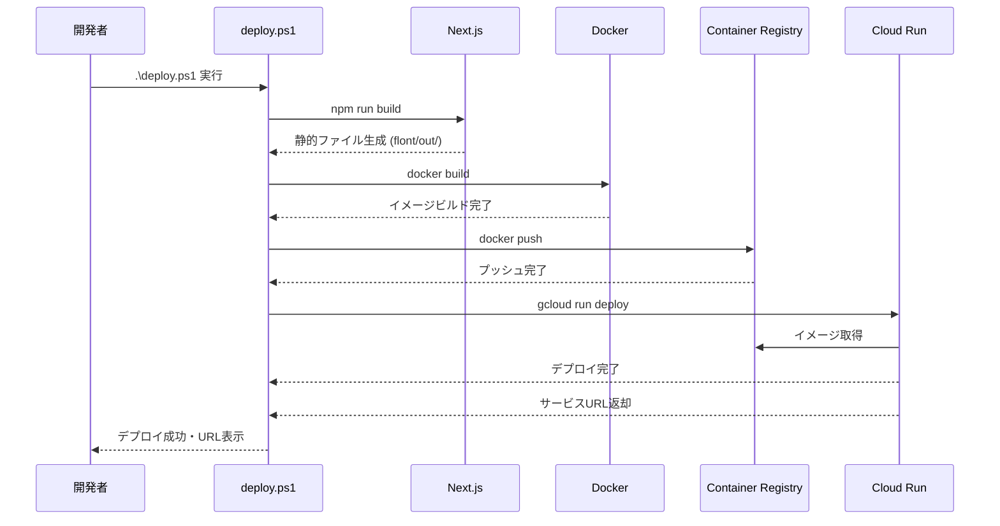
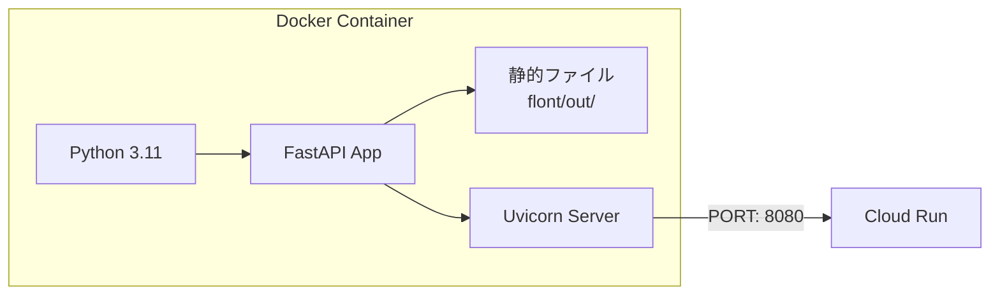
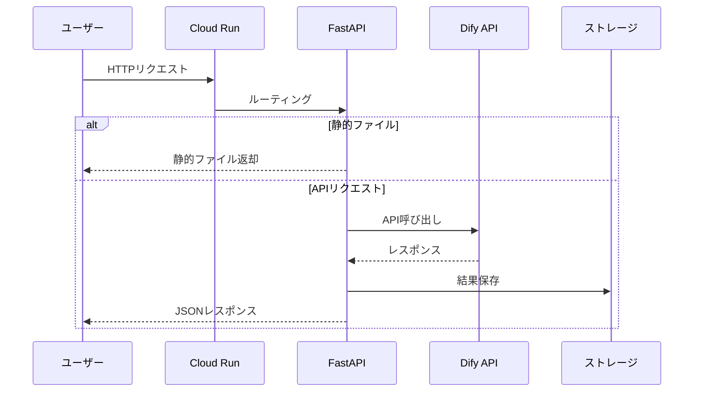

# REACHA Google Cloud Run アーキテクチャ設計書

このドキュメントは、REACHAアプリケーションのGoogle Cloud Runデプロイに関する設計書です。システムアーキテクチャ、デプロイフロー、主要コマンド、ファイル構成、運用ガイドを含みます。

## 目次

1. [システムアーキテクチャ](#システムアーキテクチャ)
2. [デプロイフロー](#デプロイフロー)
3. [ファイル構成](#ファイル構成)
4. [主要コマンドリファレンス](#主要コマンドリファレンス)
5. [更新・運用ガイド](#更新運用ガイド)

---

## システムアーキテクチャ

### 全体アーキテクチャ図

```mermaid
graph TB
    subgraph Local["ローカル開発環境"]
        Dev[開発マシン]
        Docker[Docker Desktop]
        GCloud[Google Cloud CLI]
    end
    
    subgraph GCP["Google Cloud Platform"]
        subgraph Build["ビルド・デプロイ"]
            GCR[Container Registry]
            CB[Cloud Build<br/>オプション]
        end
        
        subgraph Runtime["実行環境"]
            CR[Cloud Run<br/>reacha-app]
            CR_Service[FastAPI Service]
            CR_Static[静的ファイル<br/>Next.js]
        end
        
        subgraph Storage["ストレージ"]
            CS[Cloud Storage<br/>オプション]
            Tmp[/tmp/outputs<br/>一時ストレージ]
        end
        
        subgraph External["外部サービス"]
            Dify[Dify API]
        end
    end
    
    subgraph Users["ユーザー"]
        Browser[Webブラウザ]
    end
    
    Dev -->|ビルド| Docker
    Docker -->|プッシュ| GCR
    GCloud -->|デプロイ| CR
    GCR -->|イメージ取得| CR
    
    CR --> CR_Service
    CR --> CR_Static
    CR_Service -->|読み書き| Tmp
    CR_Service -->|API呼び出し| Dify
    CR_Service -->|永続化<br/>オプション| CS
    
    Browser -->|HTTPS| CR
    CR -->|レスポンス| Browser
    
    CB -.->|自動デプロイ<br/>オプション| GCR
```

### コンポーネント説明

#### 1. ローカル開発環境

- **開発マシン**: コードの編集とビルド
- **Docker Desktop**: コンテナイメージのビルド
- **Google Cloud CLI**: デプロイと管理

#### 2. Google Cloud Platform

- **Container Registry (GCR)**: Dockerイメージの保存
- **Cloud Run**: アプリケーションの実行環境
  - FastAPIサービス: バックエンドAPI
  - 静的ファイル: Next.jsの静的エクスポート
- **Cloud Storage**: 永続ストレージ（オプション）
- **Cloud Build**: CI/CD（オプション）

#### 3. 外部サービス

- **Dify API**: AIワークフロー実行

---

## デプロイフロー

### デプロイフロー図



### デプロイステップ詳細

1. **フロントエンドビルド**
   - Next.jsの静的エクスポート
   - 出力先: `flont/out/`

2. **Dockerイメージビルド**
   - ベースイメージ: `python:3.11-slim`
   - 依存関係インストール
   - アプリケーションコードコピー
   - 静的ファイルコピー

3. **Container Registryへのプッシュ**
   - Docker認証設定
   - イメージプッシュ

4. **Cloud Runへのデプロイ**
   - サービス作成/更新
   - リビジョン作成
   - トラフィックルーティング

---

## ファイル構成

### プロジェクトルート構成

```
REACHA/
├── back/                    # バックエンド
│   ├── app/
│   │   ├── main.py         # FastAPIアプリケーション
│   │   └── stopwords_keywords.txt
│   ├── requirements.txt    # Python依存関係
│   └── outputs/           # 出力ファイル（ローカル開発用）
│
├── flont/                  # フロントエンド
│   ├── app/               # Next.jsアプリ
│   ├── components/         # Reactコンポーネント
│   ├── out/               # 静的エクスポート（ビルド後）
│   ├── next.config.js     # Next.js設定
│   └── package.json       # Node.js依存関係
│
├── Dockerfile             # コンテナイメージ定義
├── .dockerignore          # Dockerビルド除外ファイル
├── .gcloudignore         # Cloud Build除外ファイル
│
├── deploy.ps1            # デプロイスクリプト（Windows）
├── deploy.sh            # デプロイスクリプト（Linux/Mac）
├── cloudbuild.yaml       # Cloud Build設定（オプション）
│
├── gcloud/
│   ├── scripts/
│   │   ├── fix_gcloud_setup.ps1  # Google Cloud CLI設定修正
│   │   ├── setup_project.ps1     # プロジェクト作成スクリプト
│   │   └── refresh_path.ps1      # PATH更新スクリプト
│
└── gcloud/                      # Google Cloud関連ファイル
    ├── docs/                    # ドキュメント
    │   ├── DEPLOYMENT_GUIDE.md      # デプロイ手順書
    │   ├── ARCHITECTURE_DESIGN.md   # 設計書（本ファイル）
    │   └── BLOG_CURSOR_GCLOUD.md    # ブログ記事
    ├── scripts/                 # スクリプト
    └── cloudbuild.yaml          # Cloud Build設定
```

### 主要ファイルの役割

#### デプロイ関連

| ファイル | 役割 |
|---------|------|
| `Dockerfile` | コンテナイメージの定義。Python環境、依存関係、アプリケーションコードを含む |
| `deploy.ps1` | デプロイ自動化スクリプト。ビルドからデプロイまで一括実行 |
| `cloudbuild.yaml` | Cloud Build設定。CI/CDパイプライン定義 |

#### 設定・修正スクリプト

| ファイル | 役割 |
|---------|------|
| `gcloud/scripts/fix_gcloud_setup.ps1` | Google Cloud CLIのPython環境変数設定 |
| `gcloud/scripts/setup_project.ps1` | プロジェクト作成とAPI有効化 |
| `gcloud/scripts/refresh_path.ps1` | PATH環境変数の更新 |

#### アプリケーション

| ファイル/ディレクトリ | 役割 |
|---------------------|------|
| `back/app/main.py` | FastAPIアプリケーション。APIエンドポイントと静的ファイル配信 |
| `back/requirements.txt` | Python依存関係 |
| `flont/` | Next.jsフロントエンド。静的エクスポート設定 |
| `flont/out/` | ビルド後の静的ファイル（Dockerイメージに含まれる） |

---

## 主要コマンドリファレンス

### デプロイコマンド

#### 完全デプロイ（推奨）

```powershell
# Windows
.\deploy.ps1

# Linux/Mac
./deploy.sh
```

#### 手動デプロイ

```powershell
# 1. フロントエンドビルド
cd flont
npm run build
cd ..

# 2. Dockerイメージビルド
$PROJECT_ID = gcloud config get-value project
docker build -t gcr.io/$PROJECT_ID/reacha-app:latest .

# 3. Docker認証とプッシュ
gcloud auth configure-docker gcr.io --quiet
docker push gcr.io/$PROJECT_ID/reacha-app:latest

# 4. Cloud Runにデプロイ
gcloud run deploy reacha-app `
  --image gcr.io/$PROJECT_ID/reacha-app:latest `
  --region asia-northeast1 `
  --platform managed `
  --allow-unauthenticated `
  --memory 2Gi `
  --cpu 2 `
  --timeout 3600 `
  --max-instances 10
```

### プロジェクト管理

```powershell
# プロジェクト一覧
gcloud projects list

# 現在のプロジェクト確認
gcloud config get-value project

# プロジェクト切り替え
gcloud config set project PROJECT_ID

# プロジェクト作成（自動スクリプト）
.\gcloud\scripts\setup_project.ps1
```

### サービス管理

```powershell
# サービス一覧
gcloud run services list --region asia-northeast1

# サービス詳細
gcloud run services describe reacha-app --region asia-northeast1

# サービスURL取得
gcloud run services describe reacha-app `
  --region asia-northeast1 `
  --format 'value(status.url)'

# サービス削除
gcloud run services delete reacha-app --region asia-northeast1
```

### 環境変数管理

```powershell
# 環境変数設定
gcloud run services update reacha-app `
  --region asia-northeast1 `
  --update-env-vars `
    DIFY_API_KEY1=your_key_1,`
    DIFY_API_KEY2=your_key_2,`
    DIFY_USER_ID=REACHA_agent

# 環境変数確認
gcloud run services describe reacha-app `
  --region asia-northeast1 `
  --format 'value(spec.template.spec.containers[0].env)'

# 環境変数削除
gcloud run services update reacha-app `
  --region asia-northeast1 `
  --remove-env-vars KEY1,KEY2
```

### ログ管理

```powershell
# リアルタイムログ
gcloud run services logs tail reacha-app --region asia-northeast1

# 最近のログ（50件）
gcloud run services logs read reacha-app `
  --region asia-northeast1 `
  --limit 50

# 特定の時間範囲のログ
gcloud run services logs read reacha-app `
  --region asia-northeast1 `
  --limit 100 `
  --format json
```

### リソース調整

```powershell
# メモリとCPUを増やす
gcloud run services update reacha-app `
  --region asia-northeast1 `
  --memory 4Gi `
  --cpu 4

# 同時実行数を制限
gcloud run services update reacha-app `
  --region asia-northeast1 `
  --max-instances 5 `
  --concurrency 10

# タイムアウト調整（最大3600秒）
gcloud run services update reacha-app `
  --region asia-northeast1 `
  --timeout 3600
```

### トラブルシューティング

```powershell
# PATH更新（Windows）
.\gcloud\scripts\refresh_path.ps1

# Google Cloud CLI設定修正
.\gcloud\scripts\fix_gcloud_setup.ps1

# Docker認証設定
gcloud auth configure-docker gcr.io --quiet

# 課金アカウントリンク
gcloud billing projects link PROJECT_ID `
  --billing-account=BILLING_ACCOUNT_ID
```

---

## 更新・運用ガイド

### コード更新時のデプロイ

#### 通常の更新

```powershell
# 1. コードを編集
# 2. デプロイスクリプトを実行
.\deploy.ps1
```

#### フロントエンドのみ更新

```powershell
# フロントエンドを再ビルド
cd flont
npm run build
cd ..

# デプロイ
.\deploy.ps1
```

#### バックエンドのみ更新

```powershell
# requirements.txtを更新した場合
# Dockerイメージが再ビルドされるため、通常のデプロイでOK
.\deploy.ps1
```

### 環境変数の更新

```powershell
# 環境変数を更新（サービス再起動なし）
gcloud run services update reacha-app `
  --region asia-northeast1 `
  --update-env-vars `
    DIFY_API_KEY1=new_key_1,`
    DIFY_API_KEY2=new_key_2
```

### リソースの調整

```powershell
# メモリ不足の場合
gcloud run services update reacha-app `
  --region asia-northeast1 `
  --memory 4Gi

# CPU不足の場合
gcloud run services update reacha-app `
  --region asia-northeast1 `
  --cpu 4
```

### ロールバック

```powershell
# リビジョン一覧
gcloud run revisions list `
  --service reacha-app `
  --region asia-northeast1

# 特定のリビジョンにロールバック
gcloud run services update-traffic reacha-app `
  --region asia-northeast1 `
  --to-revisions REVISION_NAME=100
```

### 監視とアラート

#### ログの定期確認

```powershell
# エラーログの確認
gcloud run services logs read reacha-app `
  --region asia-northeast1 `
  --limit 100 `
  | Select-String "ERROR"
```

#### メトリクスの確認

Google Cloud Consoleで以下を確認：
- リクエスト数
- レイテンシ
- エラー率
- CPU/メモリ使用率

### バックアップと復旧

#### 出力ファイルのバックアップ

現在、出力ファイルは一時ストレージ（`/tmp`）に保存されています。永続化が必要な場合：

1. **Cloud Storageへの移行**
   - `OUTPUTS_ROOT` 環境変数をCloud Storageのマウントポイントに設定
   - または、アプリケーションコードを修正してCloud Storage APIを使用

2. **定期バックアップ**
   - Cloud SchedulerとCloud Functionsを使用した自動バックアップ

### セキュリティ

#### 認証の有効化

```powershell
# 認証を有効化（本番環境推奨）
gcloud run services update reacha-app `
  --region asia-northeast1 `
  --no-allow-unauthenticated
```

#### Secret Managerの使用

```powershell
# シークレットを作成
echo -n "your_api_key" | gcloud secrets create dify-api-key-1 --data-file=-

# Cloud Runでシークレットを使用
gcloud run services update reacha-app `
  --region asia-northeast1 `
  --update-secrets DIFY_API_KEY1=dify-api-key-1:latest
```

### コスト最適化

#### リソースの最適化

```powershell
# 最小構成でデプロイ（開発環境）
gcloud run services update reacha-app `
  --region asia-northeast1 `
  --memory 512Mi `
  --cpu 1 `
  --max-instances 1
```

#### スケーリング設定

```powershell
# 最小インスタンス数を0に設定（コスト削減）
gcloud run services update reacha-app `
  --region asia-northeast1 `
  --min-instances 0

# 最大インスタンス数を制限
gcloud run services update reacha-app `
  --region asia-northeast1 `
  --max-instances 5
```

---

## アーキテクチャの詳細

### コンテナ構成



### データフロー



---

## トラブルシューティングチェックリスト

### デプロイ前

- [ ] Google Cloud CLIがインストールされている
- [ ] Pythonがインストールされ、PATHに設定されている
- [ ] Docker Desktopが起動している
- [ ] プロジェクトが作成され、課金アカウントがリンクされている
- [ ] 必要なAPIが有効化されている

### デプロイ中

- [ ] フロントエンドのビルドが成功している
- [ ] Dockerイメージのビルドが成功している
- [ ] Container Registryへのプッシュが成功している
- [ ] Cloud Runへのデプロイが成功している

### デプロイ後

- [ ] サービスURLにアクセスできる
- [ ] アプリケーションが正常に動作している
- [ ] 環境変数が正しく設定されている
- [ ] ログにエラーが表示されていない

---

## 参考リンク

- [Google Cloud Run ドキュメント](https://cloud.google.com/run/docs)
- [Container Registry ドキュメント](https://cloud.google.com/container-registry/docs)
- [Cloud Build ドキュメント](https://cloud.google.com/build/docs)
- [FastAPI ドキュメント](https://fastapi.tiangolo.com/)
- [Next.js ドキュメント](https://nextjs.org/docs)

---

## まとめ

この設計書は、REACHAアプリケーションのGoogle Cloud Runデプロイに関する包括的なガイドです。システムアーキテクチャ、デプロイフロー、主要コマンド、運用ガイドを含んでいます。

定期的にこのドキュメントを更新し、新しい知見や改善点を反映してください。

