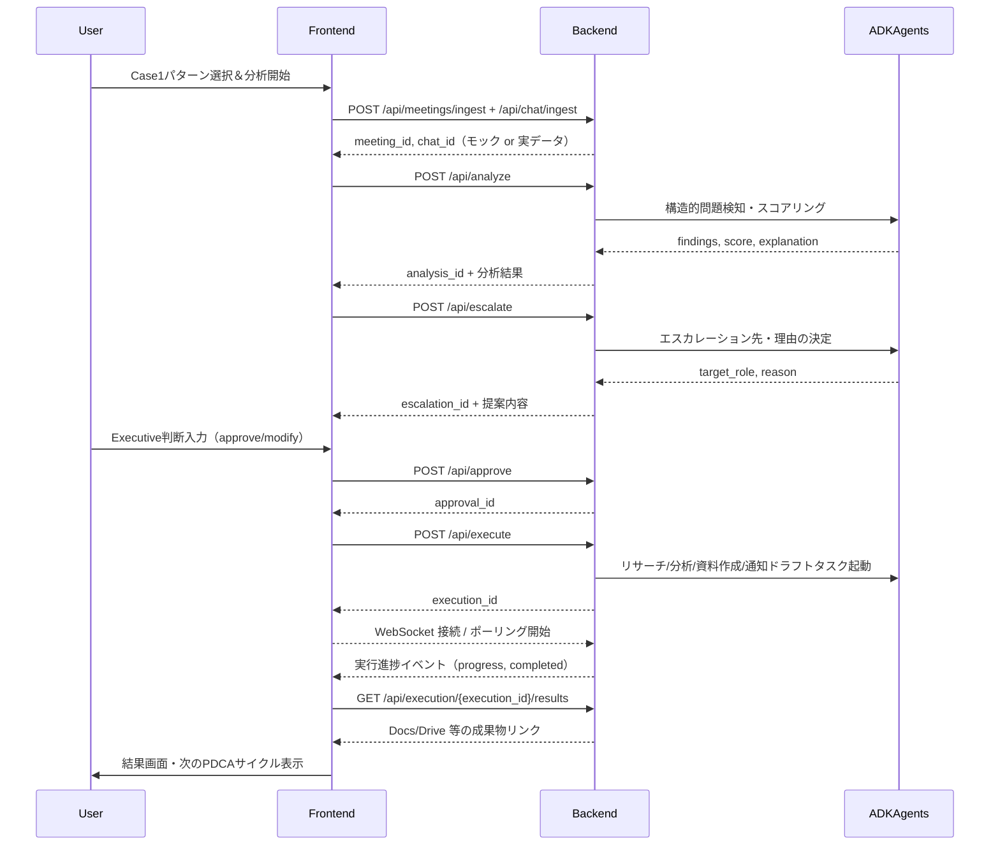

# Case1 実行フロー（デモ用／モック前提）

## 全体像

Case1（経営会議後：戦略見直しの構造的先送り）の実行フローは、

- フロントエンド（Next.js / `app/demo/case1/page.tsx`）
- バックエンド（FastAPI / `backend/main.py` + 各種サービス）
- ADKベースのエージェント群

が連携して、以下の 8 ステップで動作する設計になっている（モック中心だが、2〜3ヶ月で実装可能な構造を前提）。

## フロー（箇条書き）

1. ユーザーが Case1 画面で「パターン A/B/C」を選択し、「Helm がある場合を見る」をクリック  
   - フロント: `POST /api/meetings/ingest` / `POST /api/chat/ingest` を呼び出し  
   - バックエンド: `GoogleMeetService._get_mock_transcript` と `GoogleChatService._get_mock_messages` で
     議事録と会議後チャットをモックとして取り込み、パース結果を返す

2. Helm 構造診断（分析）  
   - フロント: `POST /api/analyze` を実行し、`analysis_id` を受け取る  
   - バックエンド:
     - 会議ログ・チャットログをもとに、ルールベース＋LLM を組み合わせた構造的問題検知エンジンを実行
     - パターンID（例: `B1_正当化フェーズ`）・スコア・重要度・緊急度・証拠リスト・定量メトリクスを生成  
     - エージェント/LLM が失敗した場合はモックにフォールバックする設計

3. Executive へのエスカレーション案生成  
   - フロント: `POST /api/escalate` を実行し、`escalation_id` を受け取る  
   - バックエンド:
     - 構造スコアやリスクレベルに応じて「誰に・どのレベルで」上げるべきかを決定
     - 対象ロール（例: CFO, CEO, 経営会議）と、その理由テキストを返却

4. Executive の判断（人間の意思決定）  
   - フロント: ユーザーが「了承する / 一部修正して実行」を選択し、`POST /api/approve` を実行  
   - バックエンド:
     - 判断結果（approve / modify）と必要に応じた修正内容を `approval_id` として記録
     - ここは「人の最終判断を必須とする」前提（AI が勝手に決めきらない）

5. AI 自律実行の開始  
   - フロント: `POST /api/execute` を実行し、`execution_id` を受け取る  
   - バックエンド:
     - Approval を起点に、実行タスクのキューを構築  
       - 市場・社外データのリサーチ（`GoogleWorkspaceService.research_market_data` モック）
       - 3案比較のシミュレーション（`GoogleWorkspaceService.analyze_data` モック）
       - Docs 資料ドラフト生成（`GoogleWorkspaceService.generate_document` モック）
       - 関係者通知ドラフト作成（`GoogleWorkspaceService.send_notification` モック）
     - 実装上はバックグラウンドタスクとして処理しつつ、`execution_id` ごとに進捗を管理

6. 実行進捗のリアルタイム更新  
   - フロント:
     - `ws://.../api/execution/{execution_id}/ws` で WebSocket 接続（`ExecutionWebSocketClient`）
     - つながらない場合は `GET /api/execution/{execution_id}` のポーリングに自動フォールバック  
     - UI 上では以下の5ステップで進捗を表示（`ai_executing` ステート）
       1. 市場・社外データのリサーチ
       2. 社内データ・過去案件の統合
       3. 3案比較（継続・縮小・撤退）のシミュレーション
       4. 資料ドラフト作成と関係者への通知準備
       5. 次回会議のアジェンダ案作成
   - バックエンド:
     - タスク完了ごとに WebSocket / REST で `progress` とタスク一覧を送信
     - 失敗時はエラーコード付きメッセージを返し、フロントでユーザーフレンドリーな表示に変換

7. 実行結果の取得と成果物表示  
   - フロント: `GET /api/execution/{execution_id}/results` を実行  
   - バックエンド:
     - 生成された Docs 等の情報を `ExecutionResults` として返却  
       - `document_id`, `title`, `download_url`, `view_url`, `edit_url` など  
     - モックモードでは `GoogleWorkspaceService._mock_document` の戻り値を使用
   - フロント: 「3案比較完成」「関係者に配信」などのサマリと、Docs/Drive へのリンクを表示

8. 次の PDCA サイクルへ  
   - フロント: 「3週間後の経営会議での変化」「Helm導入後の効果指標（フェルミ推定）」を表示  
   - バックエンド: 実際の運用では、次の会議データを再度 ingest → analyze → escalate… するループを想定

## mermaid シーケンス図

## メモ（デモと本番の線引き）

- このフローは **モックデータ前提** だが、
  - API のエンドポイント
  - リクエスト/レスポンスの型
  - タスク分解（リサーチ→分析→資料ドラフト→通知ドラフト）
  はそのまま本番実装でも使い回せるように設計している。
- 実運用では、Google Meet/Chat/Drive/Docs API や Vertex AI Search との接続を有効化することで、
  各ステップの「モック」を徐々に「実データ」に置き換えていく方針。

